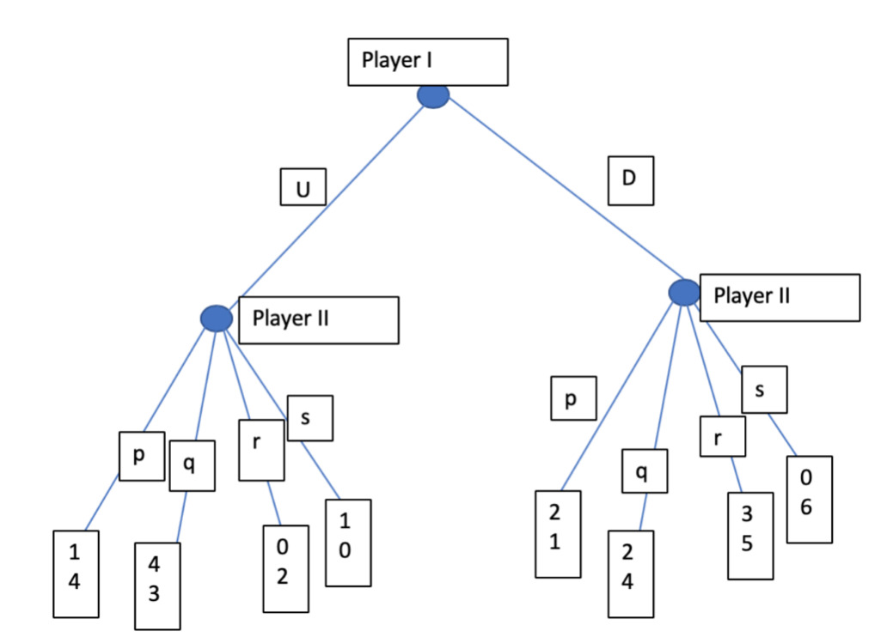
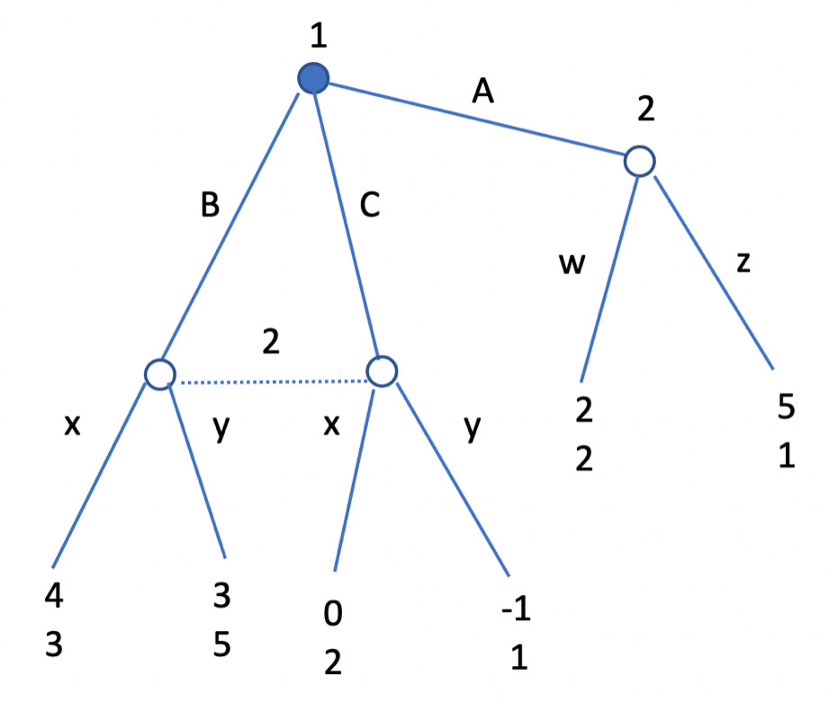
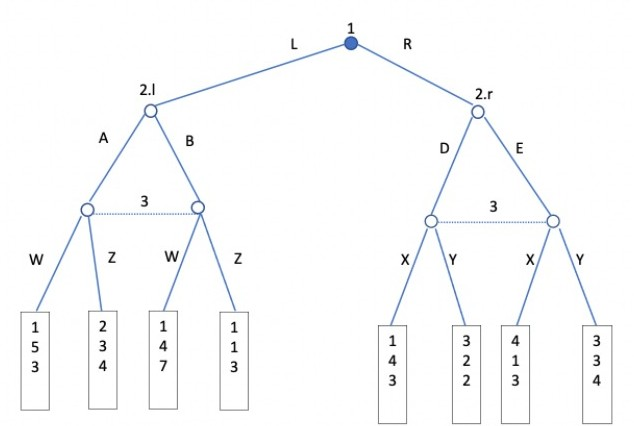
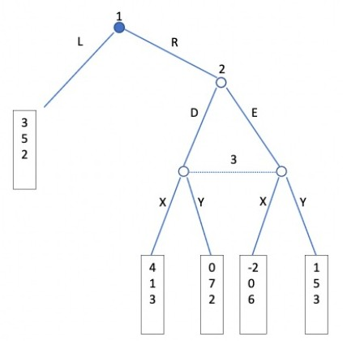
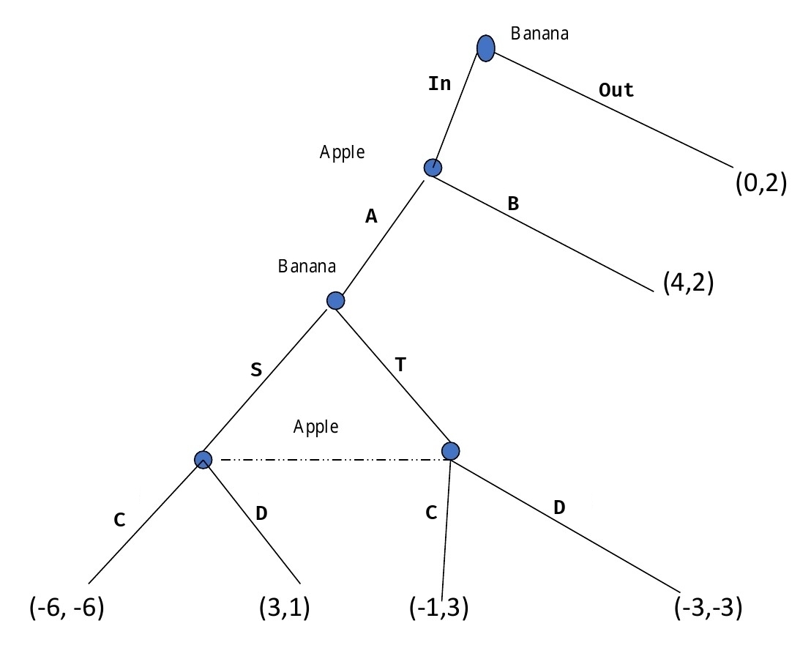
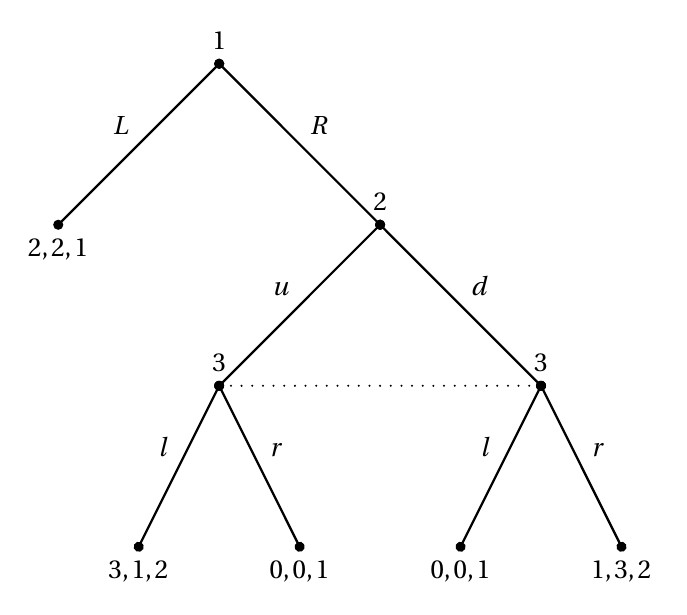
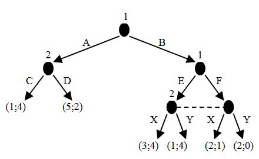

# Exam questions

## Simultaneous games

### Pure strategies
In this kind of games each player knows the possible payoffs, so they can suppose what the other player will choose in order to mazimize its payoff.   

To find the Nash equilibria in **pure strategies**, one has to:

1. find eventual dominant strategies for each player and choose them
2. if no dominant strategy has been found, proceed finding the best response for each player

!!! exercise
	Find all the Nash equilibria in pure strategies of the following simultaneous move game in normal form.
	
	|       | **L** | **R** |
	| ----- | ----- | ----- |
	| **A** | 6,4   | 3,9   |
	| **B** | 5,7   | 2,4   |
	
	??? solution
		Strategy A is dominant for P1, as whatever the choice of the opponent is, he is always better with the payoffs offered by A than the ones he would get by choosing B. In fact, 6>5 and 3>2.  
		Knowing that P1 will always choose A, P2 chooses R as it is the best response to this strategy. In fact, 9>4.  
		
		The final NE will then be (A,R).

!!! exercise
	Find all the Nash equilibria in pure strategies of the following simultaneous move game in normal form.
	
	|       | **L** | **R** |
	| ----- | ----- | ----- |
	| **A** | 6,4   | 3,3   |
	| **B** | 5,6   | 4,4   |
	
	??? solution
		In this case there is no dominant for strategy for P1, but L is a dominant strategy for P2.
		
		<!-- Supposing that P1 plays A, the best response for P2 would be L, as 4>3.  
		If instead P1 chooses B, the best response for P2 would still be L. -->
	    
	    Knowing that P2 will always play L, the best response for P1 will be A, as 6>5.
	    
		The final NE will then be (A,L).

!!! exercise
	Find all the Nash equilibria in pure strategies of the following simultaneous move game in normal form.
	
	|       | **U** | **V** | **Z** |
	| ----- | ----- | ----- | ----- |
	| **A** | 4,2   | 4,1   | 5,0   |
	| **B** | 2,2   | 5,1   | 1,2   |
	| **C** | 3,2   | 3,4   | 7,3   |
	| **D** | 1,2   | 4,3   | 5,2   |
	
	Choose an alternative:
	
	- [ ] There is not any Nash equilibrium in this game  
	- [ ] The unique Nash equilibrium of this game is the strategy profile (A,U)  
	- [ ] The unique Nash equilibrium of this game is the strategy profile (C,U)  
	- [ ] There are two Nash equilibria: the strategy profile (C,Z) and the strategy profile (A,U)  
	- [ ] The unique Nash equilibrium of this game is the strategy profile (C,Z)
	
	??? solution
		By trying all payoffs reported in the answer, it is possible to find out that:
		
		- (C,U) is dominated by (C,Z)
		- P2 would rather end up in (C,V) than (C,Z)
		- (A,U) is the only NE of this game as no player finds profitable to deviate
		
		The second choice is then the correct answer.

!!! exercise
	Solve this game using the iterative elimination of strictly dominated strategies.
	
	|       | **A** | **B** | **C** | **D** |
	| ----- | ----- | ----- | ----- | ----- |
	| **W** | 2,3   | 6,6   | 5,8   | 4,1   |
	| **X** | 9,4   | 4,5   | 3,5   | 2,1   |
	| **Y** | 9,2   | 5,9   | 4,7   | 3,5   |
	| **Z** | 3,1   | 3,3   | 3,0   | 6,2   |
	
	??? solution
		For P2, D is a strategy weakly dominated by B.  
		
	    |       | **A** | **B** | **C** |
	    | ----- | ----- | ----- | ----- |
	    | **W** | 2,3   | 6,6   | 5,8   |
	    | **X** | 9,4   | 4,5   | 3,5   |
	    | **Y** | 9,2   | 5,9   | 4,7   |
	    | **Z** | 3,1   | 3,3   | 3,0   |
		
		For P1, Z is a strategy dominated by Y.  
		
	    |       | **A** | **B** | **C** |
	    | ----- | ----- | ----- | ----- |
	    | **W** | 2,3   | 6,6   | 5,8   |
	    | **X** | 9,4   | 4,5   | 3,5   |
	    | **Y** | 9,2   | 5,9   | 4,7   |
		
		For P2, A is a strategy dominated by B. 
		
	    |       | **B** | **C** |
	    | ----- | ----- | ----- |
	    | **W** | 6,6   | 5,8   |
	    | **X** | 4,5   | 3,5   |
	    | **Y** | 5,9   | 4,7   |
		
		For P1, Y is a strategy dominated by W.  
		
	    |       | **B** | **C** |
	    | ----- | ----- | ----- |
	    | **W** | 6,6   | 5,8   |
	    | **X** | 4,5   | 3,5   |
		
		For P1, X is a strategy dominated by W.  
		
	    |       | **B** | **C** |
	    | ----- | ----- | ----- |
	    | **W** | 6,6   | 5,8   |
		
		At this point, P2 is better off playing C, so they end up in (W,C).
		
		The unique strategy profile surviving the iterative elimination of strictly dominated strategies is the strategy profile (W,C).
		

!!! exercise
	Consider the following "third price" auction with $n>3$ bidders.  
	The winner is the bidder who bids the highest amount. The winner pay the third highest bid.  
	Is it a weakly dominant strategy to bid her own valuation for each player? Explain your answer with an argument. 
	
	??? solution
		To bid the valuation is not a weakly dominant strategy.  
		In fact, to prove this is sufficent to show that there exists a strategy profile such that it is not a best response to bid the valuation.  
		
		Suppose P1 bids 100, P2 bids 80 and P3’s valuation is 99.  
		If P3 bids his own valuation he gets zero, while if he bids 101, he wins the auction and gets a positive payoff because he pays 80.

<!--
!!! exercise
	An internet service provider serves a population of 1M consumers. Each consumer would like to download a very large file from the internet, and may either access the internet during peak or non-peak times. At either time (peak or non-peak), the download takes N/1000 seconds to complete, where N is the number of consumers downloading the file at that same time.   
	For example, if 700k consumers choose to download at the peak time and 300k consumers choose to download it at the non-peak time, the download takes 700s during the peak time and 300s during the non-peak time.  
	For each consumer, the inconvenience of downloading the file during the non-peak time is equivalent to waiting an additional 500s for it. 
	
	1. In the Nash equilibrium, how many peak-time users and non-peak-time users are there?
	2. To achieve social efficiency (i.e. to minimize total waiting time and inconvenience costs faced by all consumers), how many users should there be at each time? Suppose that the ISP charges an additional fee for using the internet during peak hours. Assume that each consumer values time at 1c per second (i.e. waiting an additional second is equivalent to paying an additional cent)
	3. When the additional fee is 1€, how many users are there at each time?
	4. How much should the additional fee be in order to induce the socially efficient outcome?
	
	??? solution
		1. In equilibrium every consumer should be indifferent between peak and no peak time, so 750000 at peak time and 250000 at non-peak time
		2. There are too many consumers at peak time (typical inefficiency due to the fact that consumers do not take into account the negative externalities in increasing the downloading time of others). Let x be the number of consumers in thousands in non-peak time, to min the cost efficiency we have 
		    $$
		    min((1000 − x)2 + x(x + 500) \leadsto x = 625
		    $$
		    625 is the optimal number of consumers in peak time.
		3. As before in equilibrium consumers should be indifferent: 
		    $$
		    \begin{split}
		    (1000 − x) + 100 &= x + 500 \\
		    x &= 300 \\
		    \end{split}
		    $$
		4. Let $p$ be the fees in cents: 
		    $$
		    \begin{split}
		    625 + p &= 375 + 500 \\
		    p &= 25000 \\
		    &= 2.50€ \\
		    \end{split}
		    $$
-->

### Mixed strategies

If no Nash equilibria can be found in pure strategy, it is possible to find Nash equilibria in **mixed strategies** only if:

- there are more than one NEPS
- there are no NEPS

To find the Nash equilibria in mixed strategies, one has to:

1. eliminate eventual dominated strategies to remain with a  2x2 matrix
2. assign a probability to each player's strategy (usually $\alpha$ for player 1's first strategy and $\beta$ for player 2's first strategy)
3. calculate these probabilites with an equation

 Assuming that P1 can play A or B and P2 can play X or Y, for alpha, the equation is the following:

$$
\alpha \times P_2(A,X) + (1-\alpha) \times P_2(B,X) = \alpha \times P_2(A,Y) + (1-\alpha) \times P_2(B,Y)
$$

The first part of the equation is made by summing:

- the product between $\alpha$ and the payoff of P2 when he chooses X and P1 chooses A. Probability: $\beta \times \alpha$
- the product between $(1-\alpha)$ and the payoff of P2 when he chooses X and P1 chooses B. Probability: $\beta \times (1-\alpha)$

The second part of the equation is made by summing:

- the product between $\alpha$ and the payoff of P2 when he chooses Y and P1 chooses A. Probability: $(1-\beta) \times \alpha$
- the product between $(1-\alpha)$ and the payoff of P2 when he chooses Y and P1 chooses B. Probability: $(1-\beta) \times (1-\alpha)$

Beta is calculated in a simmetric way:

$$
\beta \times P_1(A,X) + (1-\beta) \times P_1(A,Y) = \beta \times P_1(B,X) + (1-\beta) \times P_1(B,Y)
$$

The first part of the equation is made by summing:

- the product between $\beta$ and the payoff of P1 when he chooses A and P2 chooses X. Probability: $\alpha \times \beta$
- the product between $(1-\beta)$ and the payoff of P1 when he chooses and P2 chooses Y. Probability: $\alpha \times (1-\beta)$

The second part of the equation is made by summing:

- the product between $\beta$ and the payoff of P1 when he chooses B and P2 chooses X. Probability: $(1-\alpha) \times \beta$
- the product between $(1-\beta)$ and the payoff of P1 when he chooses B and P2 chooses Y. Probability: $(1-\alpha) \times (1-\beta)$

!!! exercise
	Find all the Nash equilibria in pure and mixed strategies of the following simultaneous move game in normal form.
	
	|       | **L** | **R** |
	| ----- | ----- | ----- |
	| **A** | 3,4   | 2,6   |
	| **B** | 1,7   | 5,0   |
	
	??? solution
		Since in this game there are no NEPS, it is possible to search for NEMS.
		
		Let's assume that P1 chooses A with probability $\alpha$ and B with probability $1-\alpha$.  
		P2 chooses L with probability $\beta$ and R with probability $1-\beta$.
		To calculate these probabilites there is the need for two equations:
		
		$$
		\begin{split}
		4\alpha + 7(1-\alpha) &= 6\alpha + 0(1-\alpha) \\
		4\alpha + 7 - 7\alpha &= 6\alpha \\
		-3\alpha + 7 &= 6\alpha \\
		-9\alpha &= -7 \\
		\alpha &= \frac{-7}{-9} \\
		\alpha &= \frac{7}{9} \\
		\\
		3\beta + 2(1-\beta) &= 1\beta + 5(1-\beta) \\
		\beta + 2 &= -4\beta + 5 \\
		5\beta &= 3 \\
		\beta &= \frac{3}{5} \\
		\end{split}
		$$
		 
		 In mixed strategies P1 plays A with probability 7/9 and B with probability 2/9, P2 plays L with probability 3/5 and R with probability 2/5.

!!! exercise
	Find all the Nash equilibria in pure and mixed strategies of the following simultaneous move game in normal form.
	
	|       | **L** | **R** |
	| ----- | ----- | ----- |
	| **U** | 3,4   | 4,6   |
	| **D** | 2,6   | 5,4   |
	
	??? solution
		There is no NE in pure strategy.
		
		In mixed strategy there is the need to calculate $\alpha$ and $\beta$:
		
		$$
		\begin{split}
		4\alpha + 6(1-\alpha) &= 6\alpha + 4(1-\alpha) \\
		4\alpha + 6 - 6\alpha &= 6\alpha + 4 - 4\alpha \\
		-4\alpha &= -2 \\
		\alpha &= \frac{-2}{-4} \\
		\alpha &= \frac{1}{2} \\
		\\
		3\beta + 4(1-\beta) &= 2\beta + 5(1-\beta) \\
		3\beta + 4 - 4\beta &= 2\beta + 5 - 5\beta \\
		-\beta + 4 &= -3\beta + 5 \\
		2\beta &= 1 \\
		\beta &= \frac{1}{2} \\
		\end{split}
		$$
		
		In mixed strategies P1 plays U with probability 1/2, P2 plays L with probability 1/2.

!!! exercise
	Find all the Nash equilibria in pure and mixed strategies of the following simultaneous move game in normal form.
	
	|       | **L** | **R** |
	| ----- | ----- | ----- |
	| **U** | 4,2   | 4,1   |
	| **M** | 3,5   | 2,6   |
	| **D** | 2,3   | 5,4   |
	
	Choose an alternative:
	
	- [ ] There is only one equilibrium in pure strategies (U,L) and no equilibrium in mixed strategies  
	- [ ] There are two equilibria in pure strategies (U,L) and (D,R) and one equilibrium in mixed strategies: player 1 plays U with probability 1/3, M with probability 1/3 and D with probability 1/3, player 2 plays I with probability 1/3 and R with probability 2/3.  
	- [ ] There are two equilibria in pure strategies (U,L) and (D,R) and one equilibrium in mixed strategies: player 1 plays U with probability 1/2 and D with probability 1/2, player 2 plays L with probability 1/3 and R with probability 2/3  
	- [ ] There are two equilibria in pure strategies (U,L) and (D,R) and no equilibrium in mixed strategies.  
	- [ ] There are two equilibria in pure strategies (U,L) and (D,R) and one equilibrium in mixed strategies: player 1 plays U with probability 1/2 and D with probability 1/2, player 2 plays L with probability 1/2 and R with probability 1/2.
	
	Find all pure strategy and mixed strategy NE
	
	??? solution
		For P1, M is dominated by U. Overall there are two NEPS: (U,L) and (D,R).
		
		To find the NEMS, there is the need to calculate $\alpha$ and $\beta$:
		
		$$
		\begin{split}
		2\alpha + 3(1-\alpha) &= 1\alpha + 4(1-\alpha) \\
		-\alpha + 3 &= -3\alpha + 4 \\
		2\alpha &= 1 \\
		\alpha &= \frac{1}{2} \\
		\\
		4\beta + 4(1-\beta) &= 2\beta + 5(1-\beta) \\
		4 &= -3\beta + 5 \\
		-1 &= -3\beta \\
		\beta &= \frac{1}{3} \\
		\end{split}
		$$
		
		In mixed strategies P1 plays U with probability 1/2 and D with probability 1/2, P2 plays L with probability 1/3 and R with probability 2/3.  
		
		The third choice is then the correct answer.

!!! exercise
	Find all the Nash equilibria in pure and mixed strategies of the following simultaneous move game in normal form.
	
	|       | **L** | **M** | **R** |
	| ----- | ----- | ----- | ----- |
	| **A** | 10,4  | 10,6  | 2,4   |
	| **B** | 8,4   | 8,6   | 6,8   |
	| **C** | 6,10  | 4,12  | 4,8   |
	
	Choose an alternative:
	
	- [ ] There is only one equilibrium in pure strategies (A,L) and no equilibrium in mixed strategies.
	- [ ] There are two equilibria in pure strategies (A,M) and (B,R) and one equilibrium in mixed strategies: player 1 plays A with probability 1/2 and B with probability 1/2, player 2 plays M with probability 2/3 and R with probability 1/3.
	- [ ] There are two equilibria in pure strategies (A,L) and (B,M) and one equilibrium in mixed strategies: player 1 plays A with probability 1/3 and B with probability 2/3, player 2 plays L with probability 1/2 and M with probability 1/2.
	- [ ] There are two equilibria in pure strategies (A,M) and (B,R) and one equilibrium in mixed strategies: player 1 plays A with probability 1/3 and B with probability 2/3, player 2 plays L with probability 1/2 and R with probability 1/2. 
	- [ ] There are two equilibria in pure strategies (A,L) and (B,M) and no equilibrium in mixed strategies.
	
	??? solution
		In this case C is a dominated strategy for P1 and L is a dominated strategy for P2. The game can be then simplified as follow:
		
	    |       | **M** | **R** |
	    | ----- | ----- | ----- |
	    | **A** | 10,6  | 2,4   |
	    | **B** | 8,6   | 6,8   |
		
		Both (A,M) and (R,B) are NEPS.
		
		To find the NEMS, there is the need to calculate $\alpha$ and $\beta$:
		
		$$
		\begin{split}
		6\alpha + 6(1-\alpha) &= 4\alpha + 8(1-\alpha) \\
		6 &= -4\alpha + 8 \\
		-2 &= -4\alpha \\
		\alpha &= \frac{1}{2} \\
		\\
		10\beta + 2(1-\beta) &= 8\beta + 6(1-\beta) \\
		8\beta +2 &= -2\beta + 6 \\
		6\beta &= 4 \\
		\beta &= \frac{2}{3} \\
		\end{split}
		$$
		
		In mixed strategies P1 plays A with probability 1/2 and B with probability 1/2, P2 plays M with probability 2/3 and R with probability 1/3.  
		
		The second choice is then the correct answer.

!!! exercise
	Find all the Nash equilibria in pure and mixed strategies of the following simultaneous move game in normal form.
	
	|       | **L** | **R** |
	| ----- | ----- | ----- |
	| **A** | 2,4   | 1,5   |
	| **B** | 1,3   | 3,2   |
	
	??? solution
		There is no NE in pure strategy.
		
		In mixed strategy there is the need to calculate $\alpha$ and $\beta$:
		
		$$
		\begin{split}
		4\alpha + 3(1-\alpha) &= 5\alpha + 2(1-\alpha) \\
		4\alpha + 3 - 3\alpha - 5\alpha -2 + 2\alpha &= 0\\
		\alpha &= \frac{1}{6} \\
		\\
		2\beta + 1 - \beta &= \beta + 3(1-\beta) \\
		2\beta + 1 - \beta - \beta - 3 + 3\beta &= 0\\
		\beta &= \frac{2}{3} \\
		\end{split}
		$$
		
		In mixed strategies P1 plays A with probability 1/6, P2 plays L with probability 2/3.

!!! exercise
	Find all the Nash equilibria in pure and mixed strategies of the following simultaneous move game in normal form.
	
	|       | **L** | **R** |
	| ----- | ----- | ----- |
	| **A** | 5,4   | 5,3   |
	| **B** | 7,3   | 3,9   |
	| **C** | 4,5   | 4,2   |
	
	??? solution
		C is a dominated strategy for P1, since A always offers him better payoffs. In fact, 5>4 and 5>4.  
		The game can be simplified in its normal form:
		
	    |       | **L** | **R** |
	    | ----- | ----- | ----- |
	    | **A** | 5,4   | 5,3   |
	    | **B** | 7,3   | 3,9   |
	    
		In this game there is no NE in pure strategy.
		
		In mixed strategy there is the need to calculate $\alpha$ and $\beta$:
		
		$$
		\begin{split}
		4\alpha + 3(1-\alpha) &= 3\alpha + 9(1-\alpha) \\
		\alpha &= \frac{6}{7} \\
		\\
		5\beta + 7(1-\beta) &= 5\beta + 3(1-\beta) \\
		\beta &= \frac{1}{2} \\
		\end{split}
		$$
		
		In mixed strategies P1 plays A with probability 1/6, P2 plays L with probability 2/3.

!!! exercise
	Consider the following three-player team production problem. Simultaneously and independently, each player chooses between exerting effort (E) or not exerting effort (N). Exerting effort imposes a cost of 2 on the player who exerts effort. If two or more of the players exert effort, each player receives a benefit of 4 regardless of whether he exerted effort or not; otherwise, each player receives zero benefit.  
	The payoff to each player is his realized benefit less the cost of his effort if he exerted effort. For instance, if player 1 selects N and players 2 and 3 both select E, then the payoff vector is (4,2,2). If player 1 selects E and players 2 and 3 both select N, then the payoff vector is (−2,0,0).
	
	 1. Is there a pure-strategy equilibrium in which all three players exert effort? Explain why or why not.  
	 2. Find a symmetric mixed-strategy Nash equilibrium of this game. Let p denote the probability that an individual player selects N.
	
	??? solution
		There is not any Nash equilibrium in pure strategies in which all players exert effort, simply because in this case every player gets 2, but each player can deviate, shirk and get 4.  
		
		There is a symmetric equilibrium in mixed strategy. Let p denote the probability that each player exerts effort in the symmetric equilibrium. It must be the case that every player should be indifferent between exerting effort (with probability 1) or shirking, that is 
		
		$$
		\begin{split}
		2 ( 2p ( 1 − p ) + p^{2 )}− 2 ( 1 − p )^2 &= 4p^2 \\
		p &= \frac{1}{2} \\
		\end{split}
		$$

## Sequential games

### Complete information
In case of **complete information** players move sequentially, there is only one possible SPNE and it has to be found via backward induction:

1. find the final nodes and choose the ones with the largest payoff for the last player
2. knowing what the final player would choose, select the branch that eventually leads to the largest payoff for the previous player, and so on

When specifying the strategy set adopted by each player, it is necessary to also list the strategies that players don’t play but that are still rational.

!!! exercise
	Find all the SPNE equilibria in pure strategies of the following game in extensive form.
	
	
	
	??? solution
		P2 is better off choosing p if P1 choosed U, and s if P1 choosed D.  
		Knowing this, P1 is better off choosing U as (U,p) offers him a better payoff than (D,s) as 1>0.
		
		The final SPNE is then: P1 chooses U, P2 chooses p,s

!!! exercise
	
	Consider a market with 3 firms that produce a homogeneous product with marginal cost respectively equal to $c_0=6$, $c_1=4$ and $c_2=3$, and a market demand of $Q=12-p$ .  
	Firm 0 is already operating in the market, while in order to enter in the market each other firm has to pay a sunk cost equal to 11.  
	Consider a two stage game in which at stage 1 firms 1 and 2 sequentially decide whether to enter or not in the market: first firm 1 and then (having observed firm 1's decision) firm 2.  
	In the second stage those firms active in the market (firm 0 and all firms that entered in the market after having paid the sunk cost of entry) compete simultaneously in price.  
	
	Select the correct answer among the ones below.  
	  
	- [ ] The equilibrium outcome is such that firm 1 enters in the market, firm 2 also enters in the market and they have the same market share selling at $p=6-\epsilon$    
	- [ ] The equilibrium outcome is such that firm 1 does not enter in the market, firm 2 enters in the market and sells at $p=6-\epsilon$  
	- [ ] The equilibrium outcome is such that firm 1 enters in the market, firm 2 enters in the market and firm 2 sells at $p=4-\epsilon$  
	- [ ] The equilibrium outcome is such that neither firm 1 nor firm 2 enter in the market because the entry costs are too high and firm 3 operates as monopolist in the market.  
	- [ ] The equilibrium outcome is such that firm 1 enters in the market, firm 2 does not enter in the market; firm 1 sells at $p=6-\epsilon$
	
	??? solution 
		Since the good is homogeneous, all the market demand is captured by the player that can afford to sell at the lowest price.  
		Given that every player has a different marginal cost, to maximize profits each player should set a price larger or equal to their marginal production costs, but slightly lower than the production costs of other players.  
		This results in a situation where only the player with the lowest marginal cost is able to sell, if he makes positive profits.
		
		For instance, at time zero P0 is selling 6 units at a price equal its marginal cost, 6.
		
		$$
		\begin{split}
		c_{0} &= 6 \\
		p_{0} &= 6 \\
		Q_{0} &= 12 - p \\
		&= 6 \\
		\end{split}
		$$
		<!--
		\Pi_{0} &= Q_{0}(p_{0}-c_{0}) \\
		&= 6 \times ( 6 - 6) \\
		&= 0 \\
		\end{split}
		$$
		-->
		
		 At time 1 P1 could enter the market and price products at $p_{1} = c_{0} - \epsilon$ (slightly less than 6), and sell a quantity of goods $Q_{n}$ that multiplied by the difference between the price per unit $p_{1}$ and the marginal cost $c_{1}$, is greater than the sunk cost of entry $S$. 
		
		$$
		\begin{split}
		S &= 11 \\
		c_{1} &= 4 \\
		c_{0} &= 6 \\
		p_{1} &= c_{0} - \epsilon \\
		&= 6 - \epsilon \\
		Q_{1} &= 12 - p_{1} \\
		&= 6 \\
		\Pi_{1} &= Q_{1}(p_{1}-c_{1}) - S \\
		&= 6 \times \left( (6-\epsilon) - 4 \right) - 11 \\
		&= 1 \\
		\end{split}
		$$
		
		Hence, for P1 is convenient to enter the market.
		
		At time two P2 could set a price slightly lower than $c_{1}$, like $p_{2} = 4 - \epsilon$.  
		However, in this case he would end up with a negative profit:
		
		$$
		\begin{split}
		S &= 11 \\
		c_{2} &= 3 \\
		c_{1} &= 4 \\
		p_{2} &= c_{1} - \epsilon \\
		&= 4 - \epsilon \\
		Q_{2} &= 12 - p_{2} \\
		&= 8 \\
		\Pi_{2} &= Q_{2}(p_{2}-c_{2}) - S \\
		&= 8 \times \left( (4-\epsilon) - 3 \right) - 11 \\
		&= -3 \\
		\end{split}
		$$
		
		Hence, for P2 is not convenient to enter the market.
		
		The last choice is then the correct answer.

!!! exercise
	Five pirates have to share 100 golden ducats. At the begin of the game all pirates participate to the division. Each pirate sequentially makes a proposal based on seniority, so the order is pirate 1, 2, ..., 5.   
	If at least 50% of the pirates including the proposer accept the proposal, then it is implemented, otherwise the proposer is excluded (he gets zero and cannot vote in the following rounds) and the game continues, until the end.   
	So if the proposal of pirate 1 is rejected then pirate 2 makes a proposal that has to receive at least one vote (plus the one of the proposer), and so on.   
	
	Suppose that the proposal is with integer numbers (a ducat cannot be divided), make your prediction and explain which equilibrium concept you are applying. 
	
	??? solution
		This is a sequential game that has to be solved by backward induction. Notice that if P4 has to make a proposal it means that only him and P5 are remained and he (P4) can take everything for himself; so P5 would rather accept to receive 1 ducat by P3.  
		So P3’s optimal proposal is 99 for himself, zero for pirate 4 and 1 for P5.  
		At this point it is clear that P4 would accept 1 golden ducat by P2 (if P2 and P4 agree, P2's proposal gets approved).  
		So P2’s optimal proposal is 0,99,0,1,0.  
		Finally P1 needs 3 votes including his own vote.  
		
		So he can propose (98,1,0,1) and P2 and P5 will accept. 

### Incomplete information

In case of **incomplete information** players move simultaneously in at least one stage, there is one SPNE for each subgame and they still have to be found via backward induction:

1. divide the game in as many subgames as possible
2. proceed with backward induction for each subgame by finding the possible NE in simultaneous and sequential situations 

!!! exercise
	Find all the SPNE equilibria in pure strategies of the following game in extensive form.
	
	
	
	Choose an alternative:
	
	- [ ] There is a Nash equilibrium of this game in which Player 1 plays A and player 2 plays (x,z)  
	- [ ] The strategy profile Player 1 plays C, Player 2 plays (x,z) is a Nash equilibrium which is not a Subgame Perfect  
	- [ ] The unique Nash equilibrium of this game is Player 1 plays B, Player 2 plays x  
	- [ ] The unique Nash equilibrium of this game is Player 1 plays B, Player 2 plays (x,w)
	- [ ] There is a Nash equilibrium of this game in which Player 1 plays B and player 2 plays (y,z)
	- [ ] There is a Nash equilibrium of this game in which Player 1 plays B and player 2 plays (y,w)
	
	??? solution
		In this game there is only one subgame, the whole game.  
		It is made of a sequential (complete information) part and a simultaneous (incomplete information) part.
		
		To solve the sequential part, P2 would choose w if P1 chooses A, as 2>1.
		
		To solve the simultaneous part, the game can be represented in its normal form:
		
		|       | **x** | **y** |
		| ----- | ----- | ----- |
		| **B** | 4,3   | 3,5   |
		| **C** | 0,2   | -1,1  |
		
		Knowing that B is a dominant strategy for P1, P2 would choose y to maximize his payoff.
		
		The strategy set for P1 is B, while the one for P2 is (y,w).
		
		The last choice is then the correct answer.

!!! exercise
	Find all the SPNE equilibria in pure strategies of the following game in extensive form.
	
	
	
	Choose an alternative:
	  
	- [ ] There is one SPNE in pure strategies:
		- Player 1 plays R; player 2 plays (A,E); player 3 plays (Z,X)
	- [ ] There are two SPNE in pure strategies.
		- Player 1 plays L; player 2 plays (A,D); player 3 plays (Z,X)
		- Player 1 plays R; player 2 plays (A,E); player 3 plays (Z,Y)
	- [ ] There is one SPNE in pure strategies:
		- Player 1 plays L; player 2 plays A player 3 plays Z
	- [ ] There is one SPNE in pure strategies:
		- Player 1 plays R; player 2 plays (A,E); player 3 plays (Z,Y) 
	- [ ] There are three SPNE in pure strategies:
		- Player 1 plays L; player 2 plays (A,D); player 3 plays (Z,X)
		- Player 1 plays R; player 2 plays (A,E); player 3 plays (Z,Y)
		- Player 1 plays R; player 2 plays (A,D); player 3 plays (Z,X)

	??? solution
		This game can be divided in two subgames: 2.l and 2.r
		
		The first subgame can be represented like this:
		
		|       | **W** | **Z** |
		| ----- | ----- | ----- |
		| **A** | 5,3   | 3,4   |
		| **B** | 4,7   | 1,3   |
		
		Knowing that A is a dominant strategy for P2, P3 would choose Z to maximize his payoff.  
		The only NE is then (A,Z).
		
		The second subgame can be represented like this:
		
		|       | **X** | **Y** |
		| ----- | ----- | ----- |
		| **D** | 4,3   | 2,2   |
		| **E** | 1,3   | 3,4   |
		
		In this case there are two NE: (D,X) and (E,Y).  
		
		P1 would get 2 from (L,A,Z), 1 from (R,D,X) and 3 from (R,E,Y).  
		Since he is not sure he would get a larger payoff by playing R instead of L, he can play both of them.  		
		This leads to two SPNE:
		
		- P1 chooses L, P2 chooses (A,D), P3 chooses (Z,X)
		- P1 chooses R, P2 chooses (A,E), P3 chooses (Z,Y)
		
		The second alternative is then the correct one.

!!! exercise
	Find all the SPNE equilibria in pure strategies of the following game in extensive form.
	
	
	
	Choose an alternative:
	
	- [ ] There is a unique SPNE:
		- Player 1 plays L  
	- [ ] There is a unique SPNE in pure strategies:
	    - Player 1 plays R; Player 2 plays D; Player 3 plays X  
	- [ ] There are two SPNE:  
		- Player 1 plays L; Player 2 plays D; Player 3 plays Y  
		- Player 1 plays R; Player 2 plays D; Player 3 plays X  
	- [ ] There are two SPNE:
		- Player 1 plays L; Player 2 plays D; Player 3 plays V
		- Player 1 plays R; Player 2 plays D; Player 3 plays X  
	- [ ] There are two SPNE:
		 - Player 1 plays L; Player 2 plays D; Player 3 plays Y  
		 - Player 1 plays R; Player 2 plays D; Player 3 plays X
	
	??? solution
		In this game there is only one subgame, the whole game.  
		
		P1 would get 3 immediatly by playing L, but to understand what he would get by playing R, backward induction is necessary.  
		
		To solve the simultaneous part, the game can be represented in its normal form:
		
		|       | **x** | **Y** |
		| ----- | ----- | ----- |
		| **D** | 1,3   | 7,2   |
		| **E** | 0,6   | 5,3   |
		
		Knowing that X is a dominant strategy for P3, P2 would choose D to maximize his payoff. (Note that also D is a dominant strategy for P2) 
		P1 would end up getting 4 from (R,D,X), which is better than the 3 he would get by playing L and ending up in (L).
		
		The second choice is then the correct answer.

!!! exercise
	Find all the SPNE equilibria in pure strategies of the following game in extensive form.
	
	
	
	??? solution
		In this game there are three subgames:
		
		1. the one where Banana decides between S and T, including Apple's decision between C and D
		2. the one where Apple decides between A and B, including the previous subgame
		3. the one where Banana decides between In and Out (the whole game)
		
		The first subgame can be reprensented with in its normal form:
		
		|       | **C** | **D** |
		| ----- | ----- | ----- |
		| **S** | -6,-6 | 3,1   |
		| **T** | -1,3  | -3,-3 |
		
		In this game there are two NE, (S,D) and (T,C).
		
		Since both Apple and Banana could get better payoffs than one of these NE by playing otherwise, there are two SPNE for the entire game:
		
		- Banana plays (In,S), Apple plays (A,D)
		- Banana plays (Out,T), Apple plays (B,C)

!!! exercise
	Find all Bayesian-Nash equilibria of the following game with incomplete information:
	
	Nature chooses between Game X and Game Y with a 50% probability. Player 1 observes Nature's choice, but Player 2 does not. Player 1 chooses A or B, and simultaneously Player 2 chooses C or D.
	
	| **Game X** | **C** | **D** |
	| ---------- | ----- | ----- |
	| **A**      | 1,1   | 0,0   |
	| **B**      | 0,0   | 0,0   |
	
	| **Game Y** | **C** | **D** |
	| ---------- | ----- | ----- |
	| **A**      | 0,0   | 0,0   |
	| **B**      | 0,0   | 2,2   |
	
	??? solution
		In this game there are 3 Bayesian Nash equilibria: the first two can be found by finding the NEPS in the two games separately, the third one instead is found by having P1 to choose a different strategy according to Nature.
		
		If P1 chooses A after nature chooses GX, he is playing a dominant strategy, but if nature chooses GY whatever strategy he will play, he gets zero. P2 is better off choosing C, otherwise he gets zero. This leads to the first NE.  
		
		If P1 chooses B after nature chooses GY, he is playing a dominant strategy, but if nature chooses GX whatever strategy he will play, he gets zero. P2 is better off choosing D, otherwise he gets zero. This leads to another NE.  
		
		If P1 chooses his action accordingly to nature's choice (A for GX and B for GY), P2 is better off choosing D, as he gets 1 in expected term, and 1/2 if he deviates. This leads to another NE.  
		
		At the end, these are the 3 Bayesian Nash equilibria in pure strategies in this game:
		
		- P1 plays A both when observing GX and when observing GY, P2 plays C
		- P1 plays B both when observing GX and when observing GY, P2 plays D
		- P1 plays A when observing GX and plays B when observing GY, P2 plays D

!!! exercise
	Consider this 3-player extensive form game given by the following tree and find all the SPNE
	
	
	
	??? solution
		In this game there are two subgames, the one from the decision node of P2, the other is the whole game.  
		
		P1 would get 2 immediatly by playing L, but to understand what he would get by playing R, backward induction is necessary.  
		
		To solve the simultaneous part, the game can be represented in its normal form:
		
		|       | **l** | **r** |
		| ----- | ----- | ----- |
		| **u** | 1,2   | 0,1   |
		| **d** | 0,1   | 3,2   |
		
		In this game there are two NE: (u,l) and (d,r). In the former, P1 would get 3 (higher than if he played L), while he would only get 1 in the latter.  
		
		This leads to two SPNE:
		
		- P1 plays L, P2 plays d, P3 plays r
		- P1 plays R, P2 plays u, P3 plays l

!!! exercise
	Given the following diagram find all the SPNE and NE:
	
	
	
	Source: [StackExchange](https://math.stackexchange.com/q/1817510)
	
	??? solution
		To find all the SPNE, we need to solve for the nash equilibria of each subgame. This game has 3 subgames:
		
		1. The game that 2 plays if P1 plays A.
		2. The game that 1 plays if P1 plays B.
		3. The whole game.
		
		In the subgame identified in 1, P2 plays C, because 4>2; P1 would then obtain 1.
		
		In the subgame identified in 2, (E,X) is the unique nash equilibrium:
		
		|       | **X** | **Y** |
		| ----- | ----- | ----- |
		| **E** | 3,4   | 1,4   |
		| **F** | 2,1   | 2,0   |
		
		This is an equilibrium because if P1 deviates, he gets 2 instead of 4, and if P2 deviates, his payoffs don't change. Therefore neither player has a profitable deviation. There are no equilibria where P1 plays F, since then it would be optimal for P2 to play X, but then P1 would have a profitable devaition to E.
		
		Finally, we think about the whole game. We know that if P1 plays A, they reach subgame 1, in which case they get 1. If they play B, they reach subgame 2, where they get 4. So P1 should play B.
		
		So the only SPNE is: P1 plays (B,E), P2 plays (C,X).  
		
		Note that this is written this in terms of strategies, not payoffs, and specified strategies at information sets that aren't reached in equilibrium. This is important, because it uniquely identifies what happens in the NE and in each subgame, unlike writing down payoffs.
		
		---
		
		To find all the NE (in bold), it is probably easiest to write down the normal form version of this game. This is a 4x4 game (P1's strategies are AE, AF, BE, BF).
		
		|        | **CY** | **DX**  | **CX**  | **DY** |
		| ------ | ------ | ------- | ------- | ------ |
		| **AE** | 1,4    | 5,2     | 1,4     | 5,2    |
		| **AF** | 1,4    | 5,2     | 1,4     | 5,2    |
		| **BE** | 1,4    | **3,4** | **3,4** | 1,4    |
		| **BF** | 2,0    | 2,1     | 2,1     | 2,0    |

<!--
!!! exercise
	Suppose Plaintiff suffers a loss and can choose either of two actions: Sue or Forgive-and-Forget.   
	If Plaintiff sues, filing suit would cost 4000 euros. At this point, assume that Defendant will attempt to settle the case by offering to pay Plaintiff 10000 euros. If Plaintiff refuses this offer, they go to court and each side has to pay 2000 euros in legal expenses. At court, there is an 80% chance that Plaintiff would win the case.   
	After this initial judgment, the losing side has an opportunity to pay 3000 euros to appeal the case: if Plaintiff 1 wins initially, there is a 10% chance that an appeal by Defendant would reverse  the judgment, but if Defendant wins initially, there is a 40% chance that an appeal by Plaintiff would reverse the judgment. If Plaintiff wins eventually, he is entitled to collect 15000 from Defendant. If Defendant wins eventually, he bears no further obligation. All players are risk neutral.
	
	1. Draw a game tree for this situation and solve it using backward induction.
	2. Explain whether it is possible for Defendant to improve his position compared to above by: 
		1. compensating Plaintiff even before being sued;
		2. offering a different settlement amount, after being sued but before going to court.
	
	??? solution
		
		Solving the following game tree by backward induction, notice that when deciding to appeal or not, the Defendant (D from now on) compares the expected benefit (saving 15000 with probability 10%) and the expected cost, equal to 3,000, so for him is not profitable to appeal. The Plaintiff (P) compares the expected benefit (getting 15000 with probability 25%) with the cost (equal to 3000) so it is convenient to appeal. So the expected payoff of P if he rejects the offer is:
		
		 $$
		 \begin{split}
		 −2,000 + \frac{4}{5} \times \left( 15000 \right) + \frac{1}{5} \times \left( \frac{3}{4} \times −3000 + \frac{1}{4} \times 12000 \right) &= X \\
		 -2000 + 12000 + 1050 &= 11050 \\
		 \end{split}
		 $$
		
		So the SPNE of the game is: "P should sue, go to court and appeal in case he loses; D should not appeal".
		
		---
		
		The Defendant should offer the minimum compensation making P indifferent between accepting or rejecting it: the payoff of accepting x is x the payoff of rejecting is 11050. 
		
		Before P starts to sue, D should offer 6150.
-->

## Repeated games

### Finite repetitions

When the game is repeated a finite number of times, there are no incentives to cooperate, so independently of what has been played on the stage before, at the final round each players chooses their best response, ending up in the Nash Equilibrium.  

#### Single Nash equilibrium
If there is only one NE, the outcome will be the NE played at every stage of the game.

!!! exercise
	
	Find the NE of this game repeated a limited number of times:
	
	|       | **L** | **R** |
	| ----- | ----- | ----- |
	| **A** | 6,4   | 3,3   |
	| **B** | 5,6   | 4,4   |
	
	??? solution
		The final outcome would be (A,L), the only NE of the game.

!!! exercise
	Consider the following repeated game.
	
	|       | **L** | **R** |
	| ----- | ----- | ----- |
	| **A** | 5,6   | 3,1   |
	| **B** | 7,4   | 4,5   |
	| **C** | 3,3   | 2,3   |
	
	The simultaneous move game represented in normal form above is played three times; after each round players observe which strategy profile has been played.
	
	Select which is a correct claim among the following ones:
	
	- [ ] The unique SPNE of this game is such that Player 1 plays B at every round and Player 2 plays R at every round.  
	- [ ] There is a SPNE such that player 1 plays A in the first round, and plays A in the second round if and only if (A, L) has been played in the first round, otherwise plays C; player 1 plays B in the last round. Player 2 plays L in the first round, and plays L in the second if and only if (A, L) has been played in the first round, otherwise plays R player 2 plays R in the last round.  
	- [ ] The unique SPNE of this game is such that Player 1 plays A at every round and Player 2 plays L at every round.  
	- [ ] The unique SPNE of this game is such that Player 1 plays A in the first and second round and B in the third round; Player 2 plays L in the first and second round and R in the third one.
		
	??? solution
		 B is a dominant strategy for P1; P2 knows this and plays R as its best response.  
		 The NE (B,R) is played every time, thus the second choice is the correct answer.

!!! exercise
	Consider the following game repeated 3 times:
	
	|       | **S** | **C** | **D** |
	| ----- | ----- | ----- | ----- |
	| **L** | 3,4   | 1,5   | -1,3  |
	| **M** | 6,1   | 2,3   | -1,-1 |
	| **R** | 0,-1  | 0,0   | 0,1   |
	
	Does exist a SPNE in which the profile of strategies (L,S) is played in the equilibrium path both in stage 1 and in stage 2?  
	Explain your answer in details.
	
	??? solution
		The strategy with the largest credible punishment in equilibrium is the one where players keep playing (L,S) if they keep cooperating, and they adopt the best individualistically strategy at the final stage.  
		However, if someone betrays, they keep playing (R,D) until the end of the game:
		
		| Player | Stage 1 action | Stage 2 action             | Stage 3 action             |
		| ------ | -------------- | -------------------------- | -------------------------- |
		| P1     | L              | L if S1=(L,S), R otherwise | M if S2=(L,S), R otherwise |
		| P2     | S              | S if S1=(L,S), D otherwise | C if S2=(L,S), D otherwise |
		
		The payoff of P1 along the equilibrium path is 3+3+2=8, but if he deviates at stage 2 he gets 3+6+0=9, that is larger than the equilibrium payoff.    
		Therefore such SPNE does not exist.

#### Multiple Nash equilibria
If there is more than one NE, the outcome will be the NE that maximize the players' payoffs played at every stage of the game.

!!! exercise
	Find the NE of this game repeated a limited number of times:
	
	|       | **L** | **R** |
	| ----- | ----- | ----- |
	| **A** | 3,3   | 1,2   |
	| **B** | 2,1   | 2,2   |
	
	??? solution
		The final outcome would be (A,L), even if (B,R) is also a NE.

### Infinite repetitions

In a game repeated an infinite number of times, players can play the so-called "trigger strategy": they cooperate on a predefined payoff until one of them deviates from the agreement, starting to play individualistically.   
In fact, if one of the players cheats, the other one will punish him and the outcome will be the Nash Equilibrium.

The decision to betray or not depends on the discount factor that each player assigns to the value of time: a player **cooperates if** its discount rate $d$ is larger than the rate $\delta$ that makes the **value** he would obtain **from cooperating lower than the value from defecting**.   

The minimum discount factor $\delta$ to sustain cooperation for one player is calculated as follows:

$$
\begin{split}
\text{Value from cooperation} &= \text{Payoff from cooperation} \times \frac{1}{1-\delta} \\
\text{Value from defection} &= \text{Payoff from defection} + \text{Payoff from NE} \times \frac{\delta}{1-\delta} \\
\\
\text{Value from cooperation} &= \text{Value from defection} \\
\text{Payoff from cooperation} \times \frac{1}{1-\delta} &= \text{Payoff from defection} + \text{Payoff from NE} \times \frac{\delta}{1-\delta} \\
\delta &= \frac{\text{Payoff from cooperation} - \text{Payoff from defection}}{\text{Payoff from NE} - \text{Payoff from defection}}\\
\end{split}
$$

A player will cooperate if he has a personal discount factor $d$ larger than $\delta$, as receiving 

- the payoff from cooperation an infinite number of times

is better than receiving the sum of:

- the payoff from defection  one-off 
- the payoff from the NE an infinite number of times.

If there is more than one NE, a player can communicate its strategy to the other player and expect the other to believe him, as it's a common interest to reach the NE.

!!! exercise
	Consider the simultaneous game below played an infinite number of times.
	
	|                    | **No cooperation** | **Cooperation** |
	| ------------------ | ------------------ | --------------- |
	| **No cooperation** | 1,1                | 8,-2            |
	| **Cooperation**    | -2,6               | 5,5             |
	
	At each repetition players observe what has been played. Which is the minimum time discount $\delta$ <!--(assuming that is the same for both players)--> such that both players play cooperatively along the equilibrium path, if they both adopt in equilibrium a trigger strategy?  
	
	- [ ] 1
	- [ ] 3/7
	- [ ] 1/5
	- [ ] 1/6
	- [ ] 1/10
	
	??? solution
		Both players are better off playing Cooperation, but if one cheats, the other one plays his best response, ending up in the NE (No cooperation,No cooperation).
		
		Cooperation is only possible if both players have a discount factor large enough to make cooperation convenient.
		
		The discount factor for P1 should be at least this big to sustain cooperation:
		
		$$
		\begin{split}
		\delta &= \frac{5 - 8}{1 - 8} \\
		&= \frac{3}{7} \\
		\end{split}
		$$
		
		<!--
		$$
		\begin{split}
		5 \times \frac{1}{1-\delta} &= 8 + 1 \times \frac{\delta}{1-\delta} \\
		5 &= 8 - 8\delta + \delta \\
		3 &= 7\delta \\
		\delta &= \frac{3}{7}\\
		\end{split}
		$$
		-->
		
		The discount factor for P2 should be at least this big to sustain cooperation:
		
		$$
		\begin{split}
		\delta &= \frac{5 - 6}{1 - 6} \\
		&= \frac{1}{5} \\
		\end{split}
		$$
		
		<!--
		$$
		\begin{split}
		5 \times \frac{1}{1-\delta} &= 6 + 1 \times \frac{\delta}{1-\delta} \\
		5 &= 6 - 6\delta + \delta \\
		1 &= 5\delta \\
		\delta &= \frac{1}{5}\\
		\end{split}
		$$
		-->
		
		The minimum discount factor that sustains cooperation is the bigger among the two, as it must be acceptable for both players.
		
		3/7 is then the correct answer.

!!! exercise
	
	Find the NE of this game repeated an unlimited number of times:
	
	|       | **L** | **R** |
	| ----- | ----- | ----- |
	| **A** | 2,2   | -1,0  |
	| **B** | 4,-1   | 0,0  |
	
	??? solution
		Both players will keep playing the agreement (A,L) until someone of them betrays the other.  
		After this point, they will all play in their best interest and will end up in the NE (R,B).
		
		The final outcome would then be (R,B), even if (A,L) is also a NE.

## Useful links

- [Game Theory Explorer](https://github.com/Martin-Antonov/GTE-ng/)
- [2x2 Matrix Games Solver](https://mindyourdecisions.com/GameSolver.html)

--8<-- "docs/courses/gtsm/glossary.md"