# Exam questions

## Regression

!!! exercise
	Consider the following regression estimated on a sample of individuals living in Italy:
	
	$$
	w = \underset{(2.679)}{-14.864} +\underset{(0.401)}{1.775}e - \underset{(0.014)}{0.034}e^2 + \underset{(0.018)}{0.278}x + \underset{(0.039)}{0.084}a + \underset{(0.085)}{0.080}v + \hat{u}
	$$
	
	$w$ is the hourly wage; $e$ is the level of education (completed years of schooling), $x$ is the years of labor market experience; $v$ is the score in a test of verbal ability; $a=v+m$ where $m$ is the score in a test of mathematical ability. The standard errors of the estimated coefficient are in parentheses.
	
	Consider the case of an individual with 10 years of education. What is the expected effect on his wage of increasing by one year his labor market experience this way decreasing by one year his education?
	
	??? answer
		The expected wage for an individual with 10 years of education is:
		
		$$
		w = -14.90 + 1.80 \times 10 – 0.034 \times 10^2 + 0.278x + 0.084a + 0.080v
		$$
		
		By subtracting 1 year of education and adding 1 year of experience expected wage becomes:
		
		$$
		w = -14.90 + 1.80 \times (10-1) – 0.034 \times (10-1)^2 + 0.28(x+1) + 0.084 a + 0.080 v
		$$
		
		Then, the expected effect on wage is the difference between the second expected wages and the first one:
		
		$$
		\begin{split}
		\delta w &= 1.80 \times (9 - 10) – 0.034 \times (9^2 – 10^2) + 0.278\\
		&=-0.876
		\end{split}
		$$
	
	---
	
	Based on the results of this regression would you say that the effect on wage of $v$ is equal to the effect on wage of $m$?
	
	??? answer
		The expected wage conditional on $e$, $x$, $v$ and $m$ is:
		
		$$
		\begin{split}
		w &= -14.90 + 1.80e – 0.034e^{2} + 0.278x + 0.084(v+m) + 0.080v \\
		&= -14.90 + 1.80e – 0.034e^{2} + 0.278x + 0.084m + (0.084 + 0.080)v \\
		\end{split}
		$$
		
		That is, the difference between the coefficient on $v$ and the coefficient on $m$ is as large as $0.080.  
		According to the results, this estimated value is not statistically significant.
	
	---
	
	Consider the same regression, but now omit $a$ and include $m$. Write down the value of the estimated coefficients you would get running this regression.
		
	??? answer
		In this case the expected wage on $e$, $x$, $v$, $m$ would be:
		
		$$
		w = -14.90 +1.80e – 0.034e^2 + 0.28x + 0.084m + (0.084 + 0.080)v
		$$
	
	---
	
	And what if you include $a$, $v$ and $m$?	
	
	??? answer
		There is perfect collinearity between these three variables because $a=v+m$. This is a violation of the so called "rank condition": it is impossible to run a regression of a dependent variable on a set of perfectly collinear explanatory variables.
	
	---
	
	An analyst reading these results argues that the yearly number of days with good weather in the place where each sample unit lives (weath, $h$) should be added as a regressor to this equation.  
	You check that in the data $h$ is uncorrelated with $e$, $x$, $v$, $m$.  
	Would the estimated coefficient reported here above change by including weath as an additional regressor?  
	Would the $R^2$ of the regression change? Explain.
	
	??? answer
		The omission of $h$ from the regression results in a Omitted Variable Bias (OVB) for the estimation of the coefficient of the other explanatory variables if (and only if) two conditions occur simultaneously:
		
		- The coefficient of $h$ is not zero
		- $h$ is correlated to the other explanatory variables.
		
		We do not know whether the first condtion is met but we know for sure the second is not met.  
		Then, including or excluding $h$ does not matter for the value of the other estimated parameters.  
		That is, there is no OVB in this case resulting from omitting weath from the regression.  
		
		Adding $h$ might change the value of $R^2$, though.  
		We don't know if $h$ is a relevant explanatory variable for $w$, but it could increase the variability of $w$ explained by the regression.

!!! exercise
	100 subjects tested positive to COVID-19 have been randomly split into two subgroups, 50% each. One group ($D=1$) has been treated with a newly developed therapy, the other one ($D=0$) with a standard therapy. Their health status has been recorded three months later: $Y=1$ means healthy, $Y=0$ means poor health.
	
	The regression of Y on D yields the following results:
	
	| **Regression component** | **Estimate** | **Standard error** |
	| ------------------------ | ------------:| ------------------:|
	| Intercept                |         0.10 |              0.003 |
	| D                        |         0.06 |              0.035 |
	
	Based on this results, provide an estimate of $P(Y=1|D=1)-P(Y=1|D=0)$. What does it mean? It it significant?
	
	??? answer
		Since the two groups are randomly selected, the difference between the two probabilities is the estimated effect of receiving the new therapy instead of the standard one, equal to the value of D. In fact, 
		
		- $P(Y=1|D=1)$ is the estimated probability to be healthy for those with D=1, i.e. receiving the new therapy
		- $P(Y=1|D=0)$ is the estimated probability to be healthy for those receiving the standard therapy
		
		When the dependent variable of a linear regression is binary, the regression of the dependentvariable on the explanatory variable is:
		
		$$
		\begin{split}
		E{Y|D} &= P(Y=1|D) \\
		&= \alpha_{0} + \alpha_{1} \times D \\
		\end{split}
		$$
		
		Hence in this case the estimated probability $P(Y=1|D=1)$ is the intercept of the regression plus the coefficient on D, and $P(Y=1|D=0)$ is just the intercept of the regression:
		
		$$
		\begin{split}
		P(Y=1|D=1) &= I + D \times 1 \\
		&= 0.10 + 0.06 \\
		&= 0.16 \\
		\\
		P(Y=1|D=0) &= I + D \times 0 \\
		&= 0.10 \\
		\\
		P(Y=1|D=1) - P(Y=1|D=0) &= 0.16 - 0.10 \\
		&= 0.06 \\
		\end{split}
		$$
		
		The average causal effect of the new therapy is as large as 0.06, the estimated coefficient on D.  
		This means that the new therapy increases the probability to be in good health three months later.  
		Note however that the t-stat for this estimate is $\frac{0.06}{0.035}=1.71$: there is statistical significance at level 0.10 ($t$>1.646), but not at level 0.05 ($t$<1.962). Overall, the evidence in favor of the new therapy is weak.
	
	---
	
	Derive the associated confidence interval at level 0.95 for $P(Y=1|D=0)$  
	
	??? answer
		In this case the estimated probability is just the intercept of the regressor, 0.10.  
		Its standard error is 0.003, hence the 0.95 confidence interval is given by $0.10 \pm 1.96 \times 0.003$, that is $(0.09412, 0.10588)$.
	
	---
	
	Then, the analyst decides to add regressors ($X$) on the right hand side of this regression model: age, gender, comorbidity, etc. The new estimated coefficient for $D$ is 0.058, with a standard error as large as 0.025. Explain why the estimate is nearly unchanged despite the inclusion of $X$ in the regression.
	
	??? answer
		By including $X$ in the regression, the estimated effect of $D$ is nearly unchanged because $X$ and $D$ are uncorrelated, since the two groups are randomly selected and thus equivalent (on average) with respect to any conceivable characteristic (including $X$).
	
	---
	
	Explain why the standard error of the estimated coefficient on $D$ decreases, from 0.035 to 0.025, when $X$ is added to the regression. Overall, would you say the new therapy works well?
	
	??? answer
		$X$ is uncorrelated to $D$, but it still might be correlated to $Y$. In this case, including it in the regression results in a smaller variance of the residuals.  
		Which in turn results in a smaller standard error of the estimated effect of $D$, i.e. a more precise estimate of its effect in this regression.
		
		The estimated effect of $D$ in this case is statistically significant even at level 0.05.
	
	---
	
	This study has been criticized by someone arguing that it is unethical to force patients to receive or not receive the new therapy. They argue that patients enrolled in the study should be allowed to freely choose whether or not to get the new therapy.  
	Comment on this proposal.
	
	??? answer
		 The strenght of this study relies on the perfect equivalence of the two groups, thanks to random assignment: we know for sure that the two groups differ only with respect to the therapy they received. Hence, if we find that after three months they differ with respect to their health status, there is only one possible explanation for that difference: the therapy they received.   
		 If they were allowed to choose the therapy they prefer, it might be that the two groups would be different with respect to some confounding factors. That is, different with respect to their chance to end up in good health. Irrespective of the therapy they receive.  
		 Hence, on observing that after three months they differ with respect to their health status, you do not really know how much it is due to the therapy and how much to something else.

!!! exercise
	Consider the following regression model:
	
	$$
	Y = \alpha_{0} + \alpha_{1}X + \alpha_{2}D + \alpha_{3}XD + \epsilon
	$$
	
	where $X$ is a continuous variable and $D$=1 if $X$>500, $D$=0 otherwise. The regression can be represented with the following graph:
	
	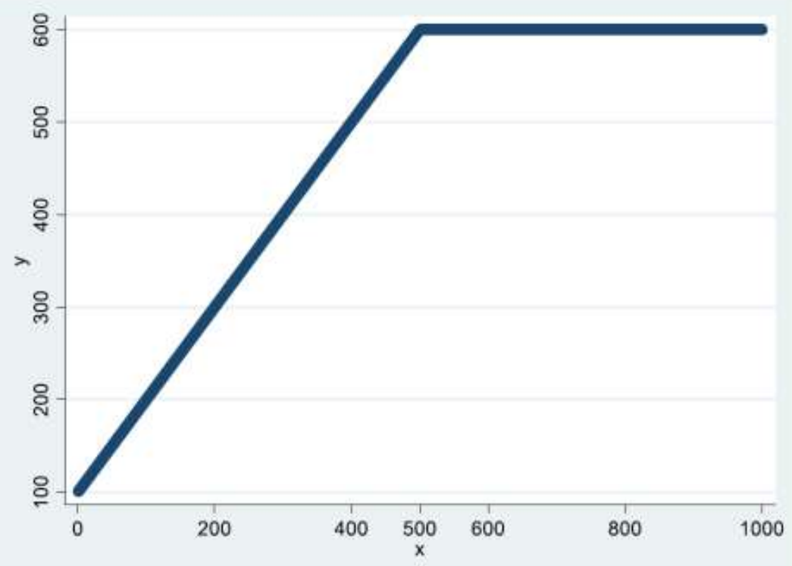
	
	Derive from the previous graph the estimated value of the four regression parameters, \alpha_{0} to \alpha_{e}.
	
	??? answer
		From the previous graph we can say that the regression increases linearly up to $X$=500, to then stay steady at $Y$?600. It touches (100,0), (500,600), and (1000,600).  
		
		Since it starts from (100,0), we have $\alpha_{0}$=100
		
		Until $X$=500, $D$=0 and the equation is:
		
		$$
		E(Y|X) = 100 + \alpha_{1}X
		$$
		
		The slope is 500/500, so we have $\alpha_{1}$=1.
		
		After $X$=500, the equation is
		
		$$
		E(Y|X) = 100 + X + \alpha_{2} + \alpha_{3}X
		$$
		
		Since the slope is now 0, $\alpha_{3}$ must be equal to -1 to cancel $\alpha_{1}$.
		
		Since $Y$ is equal to 600, $\alpha_{2}$ must be the difference between 500 and $\alpha_{0}$, so we have $\alpha_{2}$ =600.
		
		The final equation would then be:
	
		$$
		E(Y|X) = 100 + 500D + (1-D)X
		$$
	
	---
	
	Now suppose you suspect that at $X$=200 there is another break similar to the one at $X$=500. Write down the regression you would run to allow for this additional break.
	
	??? answer
		We should define a new binary variable $I$, equal to 0 if $X$<200 and equal to 1 if $X$>200.  
		The equation would then become:
		
		$$
		Y = \alpha_{0} + \alpha_{1}X + \alpha_{2}D + \alpha_{3}XD + \alpha_{4}I + \alpha_{5}XI +\epsilon
		$$

!!! exercise
	The manager in charge of deciding the credit policy to firm clients gets info on new clients from a public database collecting their past behavior. Let $X$ be a score summarizing the information recovered from this database. It takes value on a range from 1 (highly unreliable client) to 10 (higly reliable client).  
	In addition, the manager maintains his own database on behavior of his current and past clients. Let $Y$ be the delay (in days) of his clients on the date established to pay back their debt. Regressing $Y$ on $X$ he gets a model to predict future behavior $Y$ of a new client based on $X$ (standard error for the estimated coefficient in parentheses):
	
	$$
	\begin{split}
	Y &= 62.2 - \underset{(1.4)}{5.3}X + \epsilon \\
	R^{2} &= 0.52 \\
	\text{var}(\epsilon) &= 16.8 \\
	\end{split}
	$$
	
	Would you say that the score $X$ is a good predictor of $Y$? Clarify.
	
	??? answer
		The estimated coefficient on $X$ is statistically significant:
		
		$$
		\begin{split}
		t &= \frac{-5.3}{1.4} \\
		&= -3.79 \\
		-3.79 &< -1.96 \implies \text{Significant}\\
		\end{split}
		$$
		
		 The $R^2$ is not particularly large, but still not so bad.  
		 This model yields decent predictions for the behaviour of new clients.
	
	---
	
	The manager wonders whether she could improve the performance of this model by adding a new explanatory variable to the regression. Let $S$ be the size of the firm (1 if the number of employees is larger than 150, 0 otherwise). Here are the results adding it to the regression:
	
	$$
	\begin{split}
	Y &= 52.3 - \underset{(1.2)}{4.2}X + \underset{(2.1)}{4.7}S + \epsilon \\
	\text{var}(\epsilon) &= 13.3 \\
	\end{split}
	$$
	
	Derive the value of $R^2$.  
	Considering the available elements, would you add $S$ to the model? Explain.
	
	??? answer
		The original $\text{var}(Y)$ is obtained from the first equation:
		
		$$
		\begin{split}
		\text{var}(Y) &= \frac{16.8}{1-0.52} \\
		&= 35 \\
		\\
		R^{2} &= \frac{1-13.3}{35} \\
		&=0.62 \\
		\end{split}
		$$
		
		Including $S$ as an additional regressor improves the $R^2$. Moreover, its estimated coefficient is statistically significant, so $S$ should be added to the regression without doubt.
	
	---
	
	The manager test whether providing a bonus to clients provided that their delay < 10 days helps reducing the delay. He randomly selects some clients: $D$=1 for those who receive the incentive, $D$=0 for those who don’t. This is how the regression looks like including $D$ as an additional explanatory variable:
		
	$$
	Y = 53.7 - \underset{(1.2)}{4.1}X + \underset{(2.1)}{4.8}S - \underset{(2.1)}{3.5}D + \epsilon
	$$
	
	Would you say that the incentive works? Explain.
	
	??? answer
		The estimated coefficient is negative, that is the incentive exerts the expected effect by reducing the delay.  
		However, the estimate is not statistically significant: 
	
		$$
		\begin{split}
		t &= \frac{-3.5}{2.1} \\
		&= -1.67 \\
		-1.67 &< -1.96 \implies \text{Not significant} \\
		\end{split}
		$$
	
	---
	
	Finally, he adds to the model an interaction between $X$ and $D$:
		
	$$
	Y = 53.7 - \underset{(1.2)}{4.3}X + \underset{(2.1)}{4.8}S - \underset{(2.1)}{3.5}D + \underset{(0.08)}{0.2}XD + \epsilon
	$$
	
	What does the coefficient on $XD$ mean?
	
	??? answer
		The estimated coefficient on $XD$ is statistically significant. Note that by adding $XD$ to the regression the manager is allowing the coefficient of the incentive $D$ to depend on $X$:
		
		$$
		Y = 53.7 - 4.3X + 4.8S - (3.5 + 0.2X)D + \epsilon
		$$
		
		As a result, the effect of the incentive on unreliable clients ($X$=1) is -3.3, while it is -1.5 on reliable clients ($X$=10).  
		That is, even if we should take the results with a grain of salt (remember that the coefficient on D is not statistically significant), the effect of incentive seems to be tronger on unreliable clients.

!!! exercise
	A multi-site firm decides to test a new working time schedule allowing more flexibility to their employees. The new schedule is introduced in year 2 in some of the sites of the firm, while the other sites maintain the standard arrangement. The level of satisfaction of employees is measured in each site in year 1 (before the introduction of the new arrangement) and in year 2.  
	
	Let $Y_{i,t}$ be the average level of satisfaction in site $i$, $i$=1,n, in year $t$, $t$=1,2 ($i,t$ is on a scale ranging from 1=fully unsatisfied to 5=fully satisfied).  
	Let $D_{i}$=1 if the new schedule is introduced in site $i$ and $D_{i}$=0 otherwise.  
	Finally, let $T_{(t)}$=1 in the second year and $T_{(t)}$=0 in the first year.
	
	The HR manager of the firm runs the following regression to understand whether the new arrangement has had an effect on employees satisfaction (standard errors in parentheses):
		
	$$
	Y = \underset{(0.9)}{1.9} - \underset{(0.2)}{0.5}D + \underset{(0.2)}{0.4}T + \underset{(0.2)}{0.7}DT + \epsilon
	$$
	
	Then, the management of the firm meet around the table to comment on the results. Here below are the reactions from participants to the table. Add your comment to each of theirs.
	
	> "The coefficient on $D$ is negative. It means that employees do not like the new schedule."
	
	??? answer
		The coefficient on $D$ represents the difference between the two groups of firms (introducing or not the new schedule) in year 1, prior to the introduction of the new schedule.  
		That is, that difference between the two groups cannot be attributed to the new schedule, it is due to something else.  
		Hence, this comment is wrong
		
		When $T$=0 (year 1) the average difference between the two groups is the coefficient of $D$.  
		Its t-stat shows that the levels of satisfaction of the two groups are significanlty different in year 1 ($\frac{-0.5}{0.2}<-1.96$).
	
	---
	
	>  "The coefficient on T is positive, i.e. employees are more satisfied in period 2 than in period 1. It means that employees do like the new schedule."
	
	??? answer
		 The coefficient on $T$ represents the variation of average satisfaction from year 1 to year 2 for the group $D$=0.  
		 That is, this variation cannot be attributed to the introduction of the new schedule, it is due to something else.  
		  Hence, even this comment is wrong.
	
	---
	
	>  "The coefficient on $DT$ is positive, i.e. employees do like the new schedule but only in period 2, not in period 1."
	
	??? answer
		 The coefficient on $DT$ represents the additional variation of average satisfaction from year 1 to year 2 for group $D$=1, on top of the variation observed on group $D$=0.  
		 That is, the variation for group $D$=1 is as large as -0.5+0.7=0.2.  
		 Whatever this coefficient is, it cannot be that employees do not like the new schedule in year 1, because in that year no one is under the new schedule.  
		 Hence, even this comment is wrong.
	
	---
	
	 A second analyst uses only data from year 2 and runs a regression of $Y_{i,2}$ on $D_{i}$. Explain why this strategy yields a wrong estimate for the effect of the new schedule on satisfaction.
	
	??? answer
		The problem of this estimate is that the two groups we compare in year 2 ($T$=1) (after the introduction of the new schedule to the group $D$=1) are different even in year 1 ($T$=0), before the introduction of the new schedule.  
		Then, it is hardly credible that the difference we observe in year 2 is entirely due to the new schedule.
	
	---
	
	Did the average level of satisfaction change from year 1 to year 2 for reasons other than the new schedule?
	
	??? answer
		 Here we focus on variation in the level of satisfaction from year 1 ($T$=0) to year 2 ($T$=1) not due to the new schedule. The only way to measure this variation is to focus on the group $D$=0, since these units are under the standard schedule in both periods. Then, if their level of satisfaction changes over the two years it cannot be due to a variation in the time schedule.  
		Setting $D$=0 in the regression, the average variation over time is the estimated coefficient of $T$, 0.4. Its t-stat shows a significant value: $\frac{0.4}{0.2}>1.96$.
	
	---
	
	Explain to the management how to estimate the effect of the new schedule using these data, clarifying the assumption implicit in your proposal.
	
	??? answer
		 Under the "common trend" assumption that in the absence of the intervention, the variation of average satisfaction from year 1 to year 2 would have been the same for the two groups, the additional variation we observe for the group $D$=1 (the coefficient of $DT$) is the so-called "difference-in-differences" estimate of the average causal effect of the new schedule.
	

!!! exercise
	Consider the regression of $Y$ (natural logarithm of earnings) on $X_1$ (years of schooling), $X_2$ (years of labor experience) and $X_3$ (gender: 1 if female, 0 if male).  
	Here are the results (sample size=500):
		
	$$
	\begin{split}
	Y &= \underset{(2.9)}{7.8} + \underset{(0.013)}{0.085}X_{1} + \underset{(0.019)}{0.058}X_{2} - \underset{(0.01)}{0.05}X_{3} - \underset{(0.001)}{0.005}X_{1}X_{3} - \underset{(0.002)}{0.003}X_{2}X_{3} + \epsilon \\
	%\text{var}(e) &= 5.5 \\
	\sigma^{2} &= 5.5 \\
	\end{split}
	$$
	
	Is there any gender gap in average ($\ln(e)$) controlling for schooling and experience?   
	Does the size of the gender gap depend on years of schooling and/or on years of labor experience? 
	
	??? answer
		With males ($X_3$=0), the model is:
		
		$$
		\begin{split}
		Y &= 7.8 + 0.085X_{1} + 0.058X_{2} + \epsilon \\
		\end{split}
		$$
		
		With females ($X_3$=1), the model is:
		
		$$
		\begin{split}
		Y &= 7.8 + 0.085X_{1} + 0.058X_{2} - 0.05 - 0.005X_{1} - 0.003X_{2} + \epsilon \\
		&= (7.8-0.05) + (0.085-0.005)X_{1} + (0.058-0.003)X_{2} + \epsilon \\
		&= 7.75 + 0.08X_{1} + 0.055X_{2} + \epsilon \\
		\end{split}
		$$
		
		That is, the gender gap (females-males) is: 
		
		$$
		-0.05 – 0.005X_{1} – 0.003X_{2}
		$$
		
		Only the last estimate (coefficient of $X_2$, years of experience) is statistically not significant.  
		That is, there is a gender gap and it increases with the level of education.
	
	---
	
	Derive the predicted value of $Y$ conditional for a woman with 13 years of education and 10 years of experience.  
	Derive also the confidence interval for this predicted value (assume the residuals of the regression are approximately gaussian).
	
	??? answer
		It is enough to slap $X_1$=13, $X_2$=10 $X_3$=1 inside the regression:
		
		$$
		\begin{split}
		E(Y | X_{1}=13, X_{2}=10 X_{3}) &= 7.75 + 0.08 \times 13 + 0.055 \times 10 \\
		&= 7.75 + 1.04 + 0.55 \\
		&= 9.34 \\
		\\
		\text{Confidence interval} &= 9.34 \pm 1.96 \times \sqrt{\sigma^{2}}\\
		&= 9.34 \pm 1.96 \times 2.35 \\
		&= (4.74,13.93) \\
		\end{split}
		$$
	
	---
	
	What is the expected effect on Y of increasing schooling by one year, this way reducing by one year labor experience?   
	Is this effect the same to males and females?
	
	??? answer
		The combined marginal effect of increasing schooling by one year and decreasing labor experience by one year is:
		
		$$
		\begin{split}
		d_m &= \underset{(0.013)}{0.085} \times 1 + \underset{(0.019)}{0.058} \times (-1) \\
		d_f &= \underset{(0.013)}{0.085} \times 1 + \underset{(0.019)}{0.058} \times (-1) - \underset{(0.001)}{0.005} \times 1 - \underset{(0.002)}{0.003} \times (-1) \\
		&= \underset{(0.013)}{0.085} \times 1 + \underset{(0.019)}{0.058} \times (-1) - \underset{(0.001)}{0.005} \times 1 \\
		d_m - d_f &= \underset{(0.001)}{0.005}
		\end{split}
		$$
		
		We can state that the combined marginal effect depends on gender ($X_{3}$) because the coefficient of the interaction $X_{1}X_{3}$ (0.005) is statistically different from zero (SE 0.01).  
		We cannot state the same taking in consideration $X_{2}X_{3}$, as its coefficient (0.003) is not statistically relevant (SE 0.002).
		
		The difference between men and women is then the coefficient of $X_{1}X_{3}$, 0.005.
	
	---
	
	An analyst reading these results argues that a dummy variable for the size of the city where people live ($X_4$) should be added as a regressor (1=large, 0=small). You check that in the data $X_4$ is uncorrelated to $X_1$, $X_2$ and $X_3$.  
	How would the answer to question before change by including $X_4$ as an additional regressor?
	
	??? answer
		The question here is whether the omission of $X_4$ from the regression results in a omitted variable bias (OVB) for the estimation of the other parameters of the regression. We know that we have an OVB if and only if two conditions are met together:
		
		- The omitted regressor $X_{4}$ is relevant for the dependent variable $Y$
		- The omitted regressor must be correlated to at least one of the other explanatory variables $X_1$, $X_2$ and $X_3$.  
		
		We do not know whether the first condition is met (even if it is likely to be), but the text clearly states that the second condition does not hold.  
		Thus there is no OVB in this case, and results would not change by including $X_4$ in the regression.

!!! exercise
	Consider the regression of $Y$ on $X_1$, $X_2$ and $X_4$; $X_1$ and $X_2$ are quantitative variables; $X_3$ is a binary variable, half of the sample with $X_3$=0 the other half with $X_3$=1.  
	Here are the results (sample size=250):
	
	$$
	\begin{split}
	Y &= \underset{(65.2)}{150.1} + \underset{(4.1)}{10.2}X_{1} - \underset{(2.5)}{8.3}X_{2} - \underset{(3.7)}{15}X_{3} - \underset{(1.5)}{3.5}X_{1}X_{3} + \epsilon \\
	\sigma^{2} &= 100 \\
	\end{split}
	$$
	
	Adding $X_{1}^{2}$ to the other regressors, its $t$ statistics turns out as large as 2.01, while the corrected $R^2$ of the regression drops from 0.54 to 0.52. Would you keep $X_{1}^{2}$ in the regression or not? Explain.
	
	??? answer
		It depends on what exactly you want to do with this regression model. If it is intended to produce predicted values, I would drop it from the regression based on the corrected $R^2$.  
		If instead you want to use it to predict the effect on $Y$ of an increase of $X_1$, I would keep it, based on its t-stat.
		
		Note that if $X_1^2$ is included in the regression, the effect of increasing $X_1$ by 1 would become $\alpha_{1} + 2\alpha_{2}X_{1}$, where $\alpha_1$ and $\alpha_2$ are the coefficients of $X_1$ and $X_1^2$, respectively.
	
	---
	
	There is a large outlier in the sample corresponding to a unit with an average value for both $X_1$ and $X_2$. Would you drop it from the sample or keep it?
	
	??? answer
		An outlier is a problem to the estimation of a regression model if it is abnormal with respect to both $Y$ and the explanatory variable. In this case it is definitely normal with respect to both $X_1$ and $X_2$.  
		There is no need to drop it from the sample.
	
	---
	
	Derive the predicted value of $Y$ conditional on $X_1$=3, $X_2$=4 $X_3$=1.  
	Derive also the 0.95 level confidence interval for this predicted value (assume the residuals of the regression are approximately gaussian).
	
	??? answer
		To obtain the predicted value of $Y$ just plug the values of the explanatory variables in the equation:
		
		$$
		\begin{split}
		Y &= 150.1 + 10.2 \times 3 – 8.3 \times 4 + 15.0 – 3.5 \times 3 \\
		&= 165.1 + 30.6 - 33.2 - 10.5 \\
		&= 152 \\
		\text{Confidence interval} &= 152 \pm 1.96 \times \sqrt{100} \\
		&= 152 \pm 10.96 \\
		&= (141.04,168.96) \\
		\end{split}
		$$
	
	---
	
	What is the expected effect on $Y$ of increasing $X_1$ by 1 for units with $X_3$=1? Would you use the previous regression to answer this question?  
	Or rather the regression of $Y$ on $X_1$ and $X_3$ only (omitting $X_2$ from the regression)? Explain.
	
	??? answer
		Note here we are not predicting $Y$ conditional on specific values of $X_1$, $X_2$, $X_3$ as in point 1. Here we are predicting the causal effect on $Y$ of increasing the value of $X_1$ by 1. That is the effect of a change in $X_1$ keeping all other things constant.  
		
		Since $X_2$ is statistically significant, it is definitely safer to keep it in the regression to enforce the _ceteris paribus_ ("all other things constant") clause. On the other hand if it was not significant you could safely drop it from the regression.

## Time series

!!! exercise
	Analysing a time series $Y_{(t)}, t=1, 120$, an analyst finds that its ACF/PACF behave as in the graphs here below:
	
	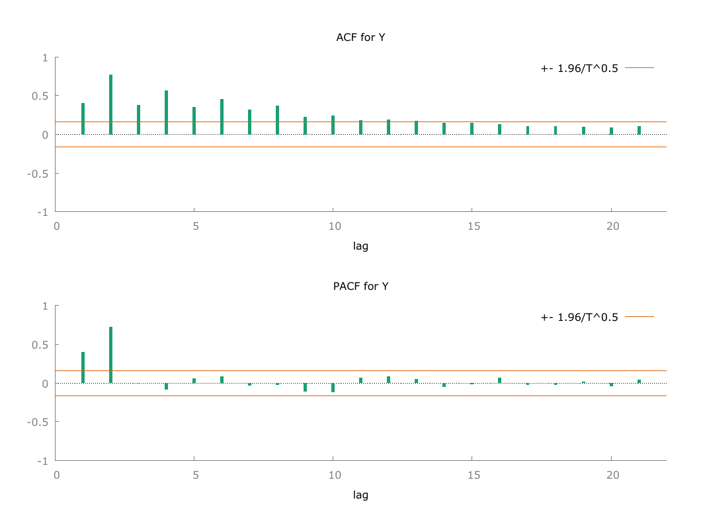
	
	 Suggest a model for the time series $Y_{(t)}$.
	 
	??? answer
		The DF test rejects the null hypothesis, that is $Y_{(t)}$ is stationary: there is no need to apply a first difference.    
		Only the first two autocorrelations are different from zero, while partial autocorrelations mildly decline to zero.  
		Then, $Y_{(t)}$ is a textbook case of $MA(2)$:
		
		$$
		Y_{(t)} = \theta_1 a_{(t-1)} + \theta_2 a_{(t-2)} + a_{(t)}
		$$
	
	---
	
	Derive the forecasting rule for periods $t$=121, 122, 123 using the model you suggest and the data up to period t=120.
	
	??? answer
		The values of $Y_{(t)}$ and $a_{(t)}$ up to period 120 are known. Future values of $a_{(t)}$ are predicted by their expected value $E(a_{(t)}) = 0$.  
		The best we can do since all the autocorrelations of $a_{(t)}$ are equal to zero, then:
		
		$$
		\begin{split}
		Y_{_{(121)}}^p &= \theta_1 a_{(120)} + \theta_2 a_{_{(119)}} \\
		Y_{_{(122)}}^p &= \theta_2 a_{(120)} \\
		Y_{_{(123)}}^p &= 0 \\
		\end{split}
		$$
	
	---
	
	 Derive the associated forecasting errors for $t$=121, 122, 123 and their variance.
	 
	??? answer
		
		$$
		\begin{split}
		e_{(121)} &= Y_{(121)} – Y_{(121)}^p \\
		&= a_{(121)} \\
		e_{(122)} &= Y_{(122)} – Y_{(122)}^p \\
		&= \theta_1 a_{(121)} + \theta_2 a_{(120)} + a_{(122)} – \theta_2 a_{(120)} \\
		&= \theta_1 a_{(121)} + a_{(122)} \\
		e_{(123)} &= Y_{(123)} – Y_{(123)}^p \\
		&= Y_{(123)} \\
		\\
		\text{var}(e_{(121)}) &= \text{var}(a_{(t)}) \\
		\text{var}(e_{(122)}) &= \text{var}(a_{(t)}) (\theta_1^2 + 1) \\
		\text{var}(e_{(123)}) &= \text{var}(a_{(t)}) (\theta_1^2 + \theta_2^2+ 1) \\
		\end{split}
		$$
	

!!! exercise
	The ACF/PACF of the time series $(1-B)Y_{(t)}, t=2, 120$, behave as in the graphs here below:
	
	
	
	The p-value of the augmented Dickey-Fuller test as applied to $(1-B)Y_{(t)}$ is as large as 0.017.
	
	Suggest a model for the time series $Y_{(t)}$.
	
	??? answer
		 The DF test rejects the null hypothesis of non stationarity, that is $(1-B)Y_{(t)}$ is stationary. ACF/PACF suggest a $\text{MA}(2)$ for $(1-B)Y_{(t)}$, that is $Y_{(t)}$ is $\text{ARIMA}(0,1,2)$:
		
		$$
		\begin{split}
		 Y_{(t)} = Y_{(t-1)} + a_{1} \times w_{(t-1)} + a_{2} \times w_{(t-2)} + w_{(t)},
		 \end{split}
		 $$
		 
		 with $w_{(t)}$ white noise.
	
	---
	
	Derive the forecasting rule for periods $t$=121, 122, 123 using the model you suggest and the data up to period $t$=120.
		
	??? answer
		
		$$
		\begin{split}
		Y_{(121)}^p &= Y_{(120)} + a_{1} \times w_{(120)} + a_{2} \times w_{(119)} + 0 \\
		Y_{(122)}^p &= Y_{(121)}^p + a_{1} \times 0 + a_{2} \times w_{(120)} + 0 \\
		&= Y_{(121)}^p + a_{2} \times w_{(120)} \\
		Y_{(123)}^p &= Y_{(122)}^p + a_{1} \times 0 + a_{2} \times 0 + 0 \\
		&= Y_{(122)}^p \\
		\end{split}
		$$
	
	---
	
	Suppose that the variance of the resulting white noise is as large as 1.7. Then, you try adding to your model an additional component, either AR or MA. Do you expect the variance of the white noise to change with respect to 1.7? Explain.
		
	??? answer
		All the available elements suggest that the model for $Y_{(t)}$ is $\text{ARIMA}(0,1,2)$. To be 100% sure we should also check the ACF/PACF of the residuals of this model (not available here). If this is an appropriate model, then adding other components such as $\text{AR}(2)$ or $\text{MA}(3)$ would not improve the model, i.e. their estimated coefficients would be zero.
		
		Then, the variance of $w_{(t)}$ would be nearly unaffected by the inclusion of these additional components.

!!! exercise
	Analysing a time series $Y_{(t)}, t=1, 120$, an analyst finds that its ACF/PACF behave as in the graphs here below:
	
	
	
	The p-value of the augmented Dickey-Fuller test is as large as 0.002.  
	
	---
	
	Suggest a model for the time series $Y_{(t)}$.
	
	??? answer
		This is a textbook case of AR(2): only PACF(1) and PACF(2) different from zero, ACF declining to zero:
		
		$$
		Y_{(t)} = \Phi_{1}Y_{(t-1)} + \Phi_{2}Y_{(t-2)} + a_{(t)}
		$$
		
		where $a_{(t)}$ is white noise with $var(a_{(t)})=\sigma^2$.
	
	---
	
	Derive the forecasting rule for periods $t$=121, 122, 123 using the model you suggest and the data up to period $t$=120.
	
	??? answer
		$$
		\begin{split}
		Y_{(121)}^{p} &= \Phi_{1}Y_{(120)} + \Phi_{2}Y_{(119)} \\
		Y_{(122)}^{p} &= \Phi_{1}Y_{(121)}^{p} + \Phi_{2}Y_{(120)} \\
		Y_{(123)}^{p} &= \Phi_{1}Y_{(122)}^{p} + \Phi_{2}Y_{(121)}^{p} \\
		\end{split}
		$$
		
		Note that every time $Y_{(t)}$ and $a_{(t)}$ enter the right hand side of the forecasting rule with $t$>120, they are replaced by $Y_{(t)}^p$ and $a_{(t)}^p$=0, respectively.
	
	---
	
	Derive the associated forecasting errors for $t$=121, 122, 123 and their variance.
	
	??? answer
		$$
		\begin{split}
		e_{(121)} &= Y_{(121)} – Y_{(121)}^p \\
		&= a_{(121)} \\
		e_{(122)} &= Y_{(122)} – Y_{(122)}^p \\
		&= \Phi_{1} \left(Y_{(121)} - Y_{(121)}^{p}\right) + a_{(122)} \\
		&= \Phi_{1} a_{(121)} + a_{(122)} \\
		e_{(123)} &= Y_{(123)} – Y_{(123)}^p \\
		&= \Phi_{1} \left(Y_{(122)} - Y_{(122)}^{p}\right) + \Phi_{2} (Y_{(121)} - Y_{(121)}^{p}) + a_{(123)} \\
		&= \Phi_{1}(\Phi_{1} a_{(121)}+a_{(122)}) + \Phi_{2} a_{(121)}+a_{(123)} \\
		&= (\Phi_{1}^{2} + \Phi_{2}) a_{(121)} + \Phi_{1} a_{(122)} + a_{(123)} \\
		\end{split}
		$$
		
		Then, since $\text{cov}(a_{(t)},a(s))$=0 whenever $t \ne s$, the variance of the forecasting errors are:
		
		$$
		\begin{split}
		\text{var}(e_{(121)}) &= \sigma^{2} \\
		\text{var}(e_{(122)}) &= (\Phi_{1}^{2} + 1) \times \sigma^{2} \\
		\text{var}(e_{(123)}) &= ((\Phi_{1}^{2} + \Phi_{2})^{2} + \Phi_{1}^{2} + 1) \times \sigma^{2} \\
		\end{split}
		$$
		

!!! exercise
	Analysing a time series $Y_{(t)}, t=1, 100$, an analyst finds that the ACF/PACF of $(1-B) \times Y_{(t)}$ behave as in the graphs here below:
	
	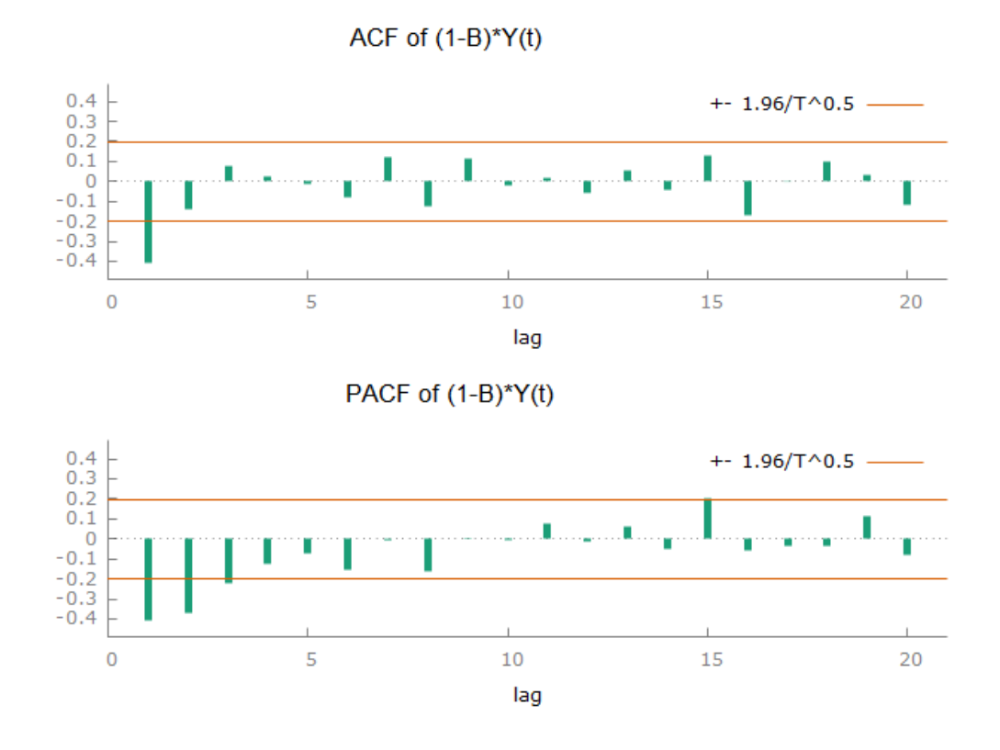
	
	 Suggest a model for the time series $Y_{(t)}$.
	
	??? answer
		Only the first autocorrelation different from zero, while partial autocorrelations mildly decline to zero.  
		Then, $(1- B) \times Y_{(t)}$ is a textbook case of MA(1).  
		That is, $Y_{(t)}$ is ARIMA(0, 1, 1):
		 
		$$
		Y_{(t)} = Y_{(t-1)} + \theta a_{(t-1)} + a_{(t)}
		$$
	
	---
	
	Derive the forecasting rule for periods $t$=101, 102, 103 using the model you suggest and the data up to period $t$=100.
	
	??? answer
		The values of $Y_{(t)}$ and $a_{(t)}$ up to period 100 are known. Future values of $a_{(t)}$ are predicted by their expected value $E(a_{(t)})=0$ the best we can do since all the autocorrelations of $a_{(t)}$ are equal to zero.
		To derive the results here below, remember that:
		
		$$
		\begin{split}
		Y_{(100+s)} &= Y_{_{(100)}} + (Y_{_{(101)}}-Y_{_{(100)}}+ \dots + (Y_{_{(100)}+s)} - Y_{(100 + s - 1)}) \\
		&= Y_{_{(100)}} + (\theta a_{_{(100)}} + a_{_{(101)}}) + \dots + (\theta a_{(100 + s - 1)} + a_{(100 + s)}) \\
		\end{split}
		$$
		
		Then,
		
		$$
		\begin{split}
		Y_{(101)} &= Y_{(100)} + (\theta a_{(100)} + a_{(101)}) \\
		Y_{(102)} &= Y_{(100)} + (\theta a_{(100)} + a_{(101)}) + (\theta a_{(101)} + a_{(102)}) \\
		&= Y_{(100)} + \theta a_{(100)} + (1 + \theta) a_{(101)} + a_{(102)} \\
		Y_{(103)} &= Y_{(100)} + (\theta a_{(100)} + a_{(101)}) + (\theta a_{(101)} + a_{(102)}) + (\theta a_{(102)} + a_{(103)}) \\
		&= Y_{(100)} + \theta a_{(100)} + (1 + \theta) a_{(101)} + (1 + \theta) a_{(102)} + a_{(103)}
		\end{split}
		$$
	
	---
	
	Derive the associated forecasting errors for $t$=101, 102, 103 and their variance.
	
	??? answer
		Call $e_{(t)} = Y_{(t)} – Y_{(t)}p$ the forecasting errors associated to the forecasting rules in the previous answer.  
		Then, following from the previous equations:
		
		$$
		\begin{split}
		e_{(101)} &= a_{(101)} \\
		e_{(102)} &= (1 + \theta) a_{(101)} + a_{(102)} \\
		e_{(103)} &= (1 + \theta) a_{(101)} + (1 + \theta) a_{(102)} + a_{(103)} \\
		\end{split}
		$$
		
		Finally, since cov{a_{(t)}, a(t+s)} = 0, it follows that:
		
		$$
		\begin{split}
		\text{var}(e_{(101)}) &= \text{var}(a_{(t)}) \\
		\text{var}(e_{(102)}) &= \text{var}(a_{(t)}) \times ((1 + \theta)^2 + 1)\\
		\text{var}(e_{(103)}) &= \text{var}(a_{(t)}) \times (2 \times (1 + \theta)^2 + 1)\\
		\end{split}
		$$
	
	---
	
	Another analyst suggests to use exponential smoothing to predict future values of $Y_{(t)}$ and wonders which value to assign to the smoothing parameter.  
	Which value would you suggest? Explain.
	
	??? answer
		The exponential smoothing forecast for $Y_{(101)}$ is:
		
		$$
		\begin{split}
		Y_{(101)}^{p} &= (1-\alpha) \times Y_{(100)} + \alpha \times Y_{(100)}^p \\
		&= Y_{(100)} – \alpha \times (Y_{(100)} – Y_{(100)}^{p}) \\
		\end{split}
		$$
		
		where $Y_{(100)}^p$ is the forecast of $Y_{(100)}$ obtained in period $t$=99.  
		The forecasting rule here is exactly the same we derived before for the ARIMA(0,1,1) model.  
		Then, the optimal choice of the smoothing parameter $\alpha$ (the one minimizing the variance of the forecasting error) is the estimated value of $\theta$ for the ARIMA(0,1,1) model.

!!! exercise
	Analyzing the time series $Y_{(t)}, t=1,60$, you have found that the following MA(2) model fits the data well:
	
	$$
	\begin{split}
	Y_{(t)} &= e_{(t)} + 0.2 \times e_{(t-1)} - 0.3 \times e_{(t-2)} \\
	\text{var}(e_{(t)}) &= 8.2 \\
	\end{split}
	$$
	
	Derive the average and the variance of $Y_{(t)}$ implied by this model
	
	??? answer
		The average of the disturbance term $e_{(t)}$ is zero, its variance is 8.2 and $\text{cov}(e_{(t)},e(s))$=0 whenever$t$ is similar to $s$. Then:
		
		$$
		\begin{split}
		E(Y_{(t)}) &= E(e_{(t)}) + 0.2 \times e_{(t-1)} - 0.3 \times e_{(t-2)} \\
		&= E(e_{(t)}) + 0.2 \times E(e_{(t-1)}) - 0.3 \times E(e_{(t-2)}) \\
		&= 0 \\
		\end{split}
		$$
	
	---
	
	Derive $\text{cov}(Y_{(t)},Y_{(t-1)})$
	
	??? answer
		
		$$
		\begin{split}
		E\big((e_{(t)} + 0.2e_{(t-1)} - 0.3e_{(t-2)}) \times (e_{(t-1)} + 0.2e_{(t-2)} - 0.3e_{(t-3)})\big) &= 8.2 \times (0.2 - 0.3 \times 0.2) \\
		&= 1.148 \\
		\end{split}
		 $$
	
	---
	
	Derive the forecasting function implied by this model for periods 61, 62, 63.
	
	??? answer
		Data on this time series is available up to time 60. Future values of $e_{(t)}$ are predicted by their expected value: $e(60+s)p$ = 0, $s$=1,2,3,... Then:
		
		$$
		\begin{split}
		Y_{(61)}^p &= 0.2 \times e_{(60)} - 0.3 \times e_{(59)} \\
		Y_{(62)}^p &= 0.3 \times e_{(60)} \\
		Y_{(63)}^p &= 0 \\
		\end{split}
		$$
	
	---
	
	Derive the variance of the forecasting errors for periods 61, 62 and 63.
	
	??? answer
		
		$$
		\begin{split}
		Y_{(61)} - Y_{(61)}^{p} &= e_{(61)} \\
		&\implies \text{var}(e_{(61)}) = 8.2 \\
		\\
		Y_{(62)} - Y_{(62)}^{p} &= e_{(62)} + 0.2 \times e_{(61)} \\
		&\implies \text{var}(e_{(61)}) = 8.2 \times (1+0.04) \\
		\\
		Y_{(63)} - Y_{(63)}^{p} &= Y_{(63)} \\
		&\implies \text{var}(e_{(61)}) = 8.2 \times (1 + 0.04 + 0.09) \\
		\end{split}
		$$

!!! exercise
	Two analysts independently develop two different forecasting rules, $yp^{A}_{(t)}$ and $yp^{B}_{(t)}$, for the time series $y_{(t)}$.   The table here below summarizes the forecasting performance of the two rules.
	
	| Rule   | Average Forecasting Error | Variance of the forecasting error |
	| ------ | -------------------------:| ---------------------------------:|
	| Rule A |                         0 |                               2.4 |
	| Rule B |                         0 |                               1.2 |
	
	The two analysts meet in a pub, compare the two rules and wonder whether a weighted average of the two rules would result in a better forecasting rule. The combined rule looks like this:
	
	$$
	yp_{(t)} = 0.5 yp^{A}_{(t)} + 0.5 yp^{B}_{(t)}
	$$
	
	Comment the statements of the two analysts.  
	Assume that the covariance between the two forecasting errors is zero.
	
	> "The combined rule is pointless, much better to take Rule B as it is and ignore the other one."
	
	??? answer
		The average forecasting error of the combined rule is:
		
		$$
		\begin{split}
		\text{AFE} &= 0.50 \times 0 + (1-0.50) \times 0 \\
		&= 0 \\
		\text{var}(\text{AFE}) &= 0.50^{2} \times 2.4 + (1-0.50)^{2} \times 1.2 \\
		&= 0.9 \\
		\end{split}
		$$
		
		That is, the combined rule is equivalent to rules A and B in terms of average forecasting error, but outperforms both rules in terms of variance of the forecasting error.  
		Hence, this comment is wrong.
	
	---
	
	> "A choice of the two weights different from 0.50/0.50 would provide a better combined rule."
	
	??? answer
		 It is straightforward to check that using, as an example, the weights 0.30/0.70 the variance of the forecasting error is smaller than the one with weights 0.50/0.50.  
		 Hence, this comment is right.
		
		Here one could also evaluate the optimal value of the weights, finding the values that minimize the variance of the combined rule.  
		
		$$
		\begin{split}
		\text{var}(w) &= w^{2} \times 2.4 + (1-w)^{2} \times 1.2 \\
		\\
		f'(\text{var}(w)) &= 0 \\
		2.4w - 2.4 &= 0 \\
		w &= 1 \\
		\\
		w_{yp^{A}_{(t)}} &= 1 - \frac{2.4}{2.4 + 1.2} \\
		&= \frac{1}{3} \\
		w_{yp^{B}_{(t)}} &= 1 - \frac{1.2}{2.4 + 1.2} \\
		&= \frac{2}{3} \\
		\end{split}
		$$
		
		That is, the optimal weights are 0.33/0.67.		
	
	---
	
	Now let the covariance between the two forecasting errors be 0.30.  
	Would you go with the combined rule even in this case? Or would you prefer one of the two rules?
	
	??? answer
		 In this case the variance of the combined rule is
		
		$$
		\begin{split}
		\text{var}(\text{AFE}) &= 0.50^{2} \times 2.4 + (1-0.50)^{2} \times 1.2 + 2 \times 0.50 \times 0.50 \times 0.30\\
		&= 0.9 + 0.15 \\
		&= 0.24 \\
		\end{split}
		$$
		
		Even in this case the combined rule outperforms both rules.

!!! exercise
	$Y_{(t)}$ is a yearly time-series including 100 observations. Here below is its graph. The analyst uses the first 60 observation to select the model and the remaning last 40 observations to check the forecasting performance of the models.
	
	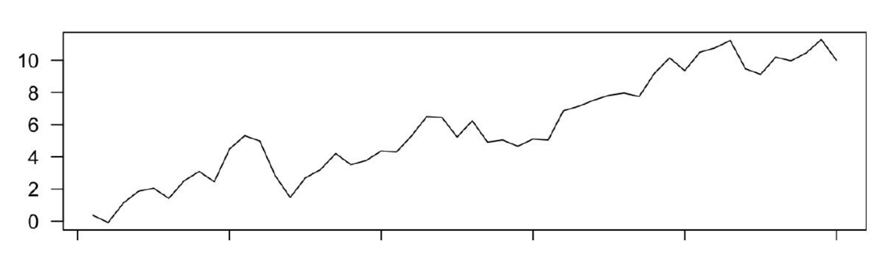
	
	After applying to it the first difference operator, the correlograms of $(1-B)Y_{(t)}$ suggests to fit either an ARMA(1,2) (first graph below) or an ARMA(1,1) (second graph below).  
	Here are the results for the two models (standard errors in parentheses) and the correlogram of their residuals (using the sample $Y_{(t)}$, $t$=1, ..., 60).
	
	ARMA(1,2):
	
	$$
	\begin{split}
	(1-B)\times(Y_{(t)}) &= \underset{(0.11)}{0.25}(1-B)(Y_{(t-1)}) - \underset{(0.15)}{0.37}e_{(t-1)} + \underset{(0.13)}{0.27}e_{(t-2)} + e_{(t)} \\
	\text{var}(e_{(t)}) &= 0.73 \\
	\end{split}
	$$
	
	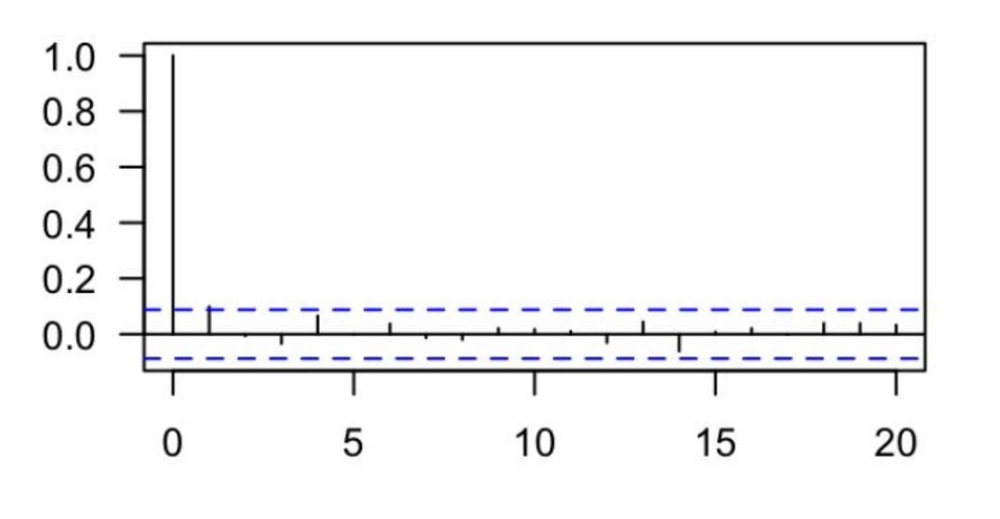
	
	ARMA(1,1):
	
	$$
	\begin{split}
	(1-B)\times(Y_{(t)}) &= \underset{(0.10)}{0.28}(1-B)(Y_{(t-1)}) - \underset{(0.14)}{0.48}e_{(t-1)} + e_{(t)} \\
	\text{var}(e_{(t)}) &= 0.80 \\
	\end{split}
	$$
	
	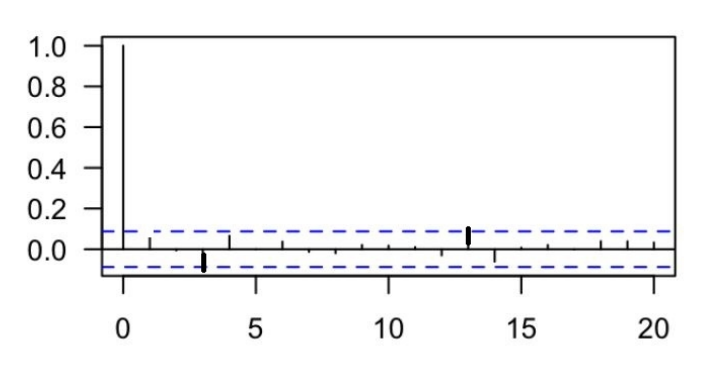
	
	Here are the forecasting performance of the two models for periods $t$=61,...,100:
	
	| Model     | Average forecasting error | Root Mean Square Error |
	| --------- | -------------------------:| ----------------------:|
	| ARMA(1,2) |                      0.50 |                   0.96 |
	| ARMA(1,1) |                     -0.30 |                   0.90 |
	
	Choose a model explaining why.
	
	??? answer
		Both models perform in a satisfactory way. Correlograms of residuals are fine.  
		Model 1 is marginally better in terms of $\text{var}(e_{(t)})$, marginally worse in terms of AFE and of RMSE. Then, both choices are feasible.
		
		I would marginally prefer model 2 because it is more parsimonious.
	
	---
	
	Derive the forecasting rule for $Y_{(t)}$ for period $t$=61 using the model you chose.  
	Derive also the corresponding confidence interval, level 0.95 (assume the residuals are gaussian).
	
	??? answer
		Using model 2:
		
		$$
		\begin{split}
		(1-B)\times Yp_{(t)} &= 0.28(1-B)Y_{(t-1)} – 0.48e_{(t-1)} \\
		Yp_{(61)} &= Y_{(60)} + 0.28(Y_{(60)} – Y(59)) – 0.48e_{(60)} \\
		\text{Confidence interval} &= Yp_{(61)} \pm 1.96 \times \sqrt{0.80} \\
		&= (Yp_{(61)} - 1.96 \times \sqrt{0.80},Yp_{(61)} + 1.96 \times \sqrt{0.80}) \\
		\end{split}
		$$

## Cluster analysis

!!! exercise
	After collecting a large number of observable characteristics, $X$, on a sample of 1000 individuals, an analyst performs a principal component analysis (PCA) of the data on $X$. Results up to the fifth principal component are reported in the following table:
	
	| Principal component | Proportion explained | Cumulative |
	| -------------------:| --------------------:| ----------:|
	|                   1 |                 0.78 |       0.78 |
	|                   2 |                 0.10 |       0.88 |
	|                   3 |                 0.05 |       0.93 |
	|                   4 |                 0.02 |       0.95 |
	|                   5 |                 0.00 |       0.95 |
	
	The analyst is wondering whether he could use a few of those principal components instead of the whole set of characteristics $X$ to identify clusters of units in this dataset. What would you say?
	
	??? answer
		The first PC explain a large fraction of the total variance in $X$. In case, one could also consider the second PC.    
		Together they account for nearly 90% of the total variance in $X$. Then, using only the first PC, and possibly the second one, the analyst is able to recognize the similarities and dissimilarities between the 1000 units with respect to whole set of variables in $X$.
	
	---
	
	The distribution of sample units with respect to the first principal component (PC1) is represented in the picture here below. 
	
	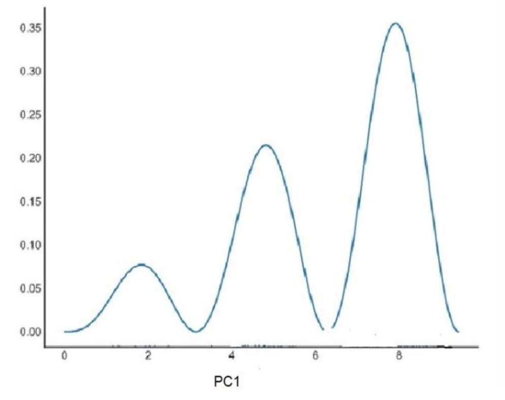
	
	Is it useful to identify the number of clusters in this dataset? How many clusters do you see?
	
	??? answer
		Using the first PC to describe who those 1000 units are, it is clear from the picture that there are three well defined groups of units: the first group of units feature values of PC1 below 3, with an average at 2; the second group of units feature values of PC1 in the range 3 to 6, with an average at 5; the third group of units feature values of PC1 above 6, with an average at 8.
	
	---
	
	Given the number of clusters you just estimate, provide a back-of-the-envelope estimate of the number of units belonging to each cluster.
	
	??? answer
		The number of units in each of the three clusters is proportional to the area under the curve of each one of them. The second area is roughly two times larger than the first one, while the third one is roughly three times larger than the first one. Let x be the number of units in the first cluster, then:
		
		$$
		\begin{split}
		1000 &= x + 2x + 3x \\
		1000 &= 6x \\
		x &= 167 \\
		\end{split}
		$$
	
	---
	
	Since PC1 is an artificial characteristic of the 1000 units, i.e it's not straightforward to say what exactly it represents, one would like to understand the main features of each of the clusters identified in the previous steps of analysis. What would you do to describe the characteristics of those clusters?
	
	??? answer
		By calculating the average of each of the three groups of unit and comparing these averages, it is possible to understand what are the three clusters.

!!! exercise
	After collecting a large number of observable characteristics $X$ on a sample of individuals as well as their membership in one of two possible classes $Y$, an analyst performs a principal component analysis of the data on $X$. Results up to the six-th principal component are reported in the following table.
	
	| Principal component | Proportion explained | Cumulative |
	| -------------------:| --------------------:| ----------:|
	|                   1 |               0.6621 |     0.6621 |
	|                   2 |               0.2425 |     0.9046 |
	|                   3 |               0.0282 |     0.9328 |
	|                   4 |               0.0174 |     0.9502 |
	|                   5 |               0.0099 |     0.9601 |
	|                   6 |               0.0051 |     0.9652 |
	
	The picture here below represents the scatterplot of the second principal component (PC2) versus the first one (PC1). Each dot represents a sample unit, the color of the dot represents its label $Y$.
	
	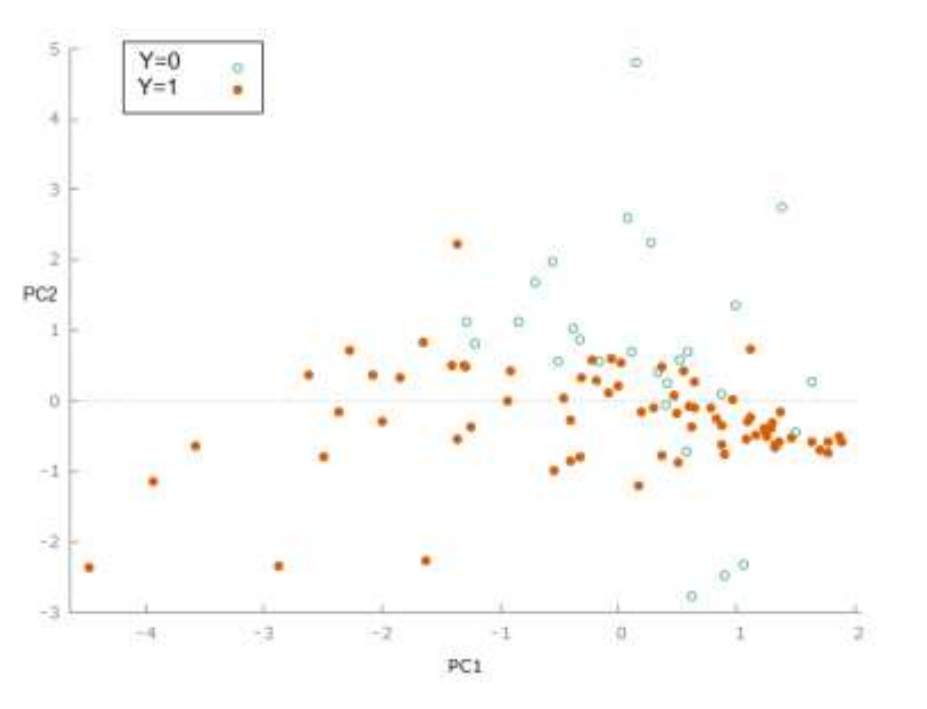
	
	Given the results of PCA, the analyst claims that to solve the problem of predicting $Y$ one can use this picture instead of using the whole set of characteristics $X$. Is the analyst right? Explain.
	
	??? answer
		According to the results of PCA reported in the table, PC1 and PC2 account for nearly all of the variability in $X$.   
	    That is, PC1 and PC2 are able to properly approximate all the info in $X$, hence to approximate the info in $X$ needed to predict $Y$.  
		
	    The value added in using PC1 and PC2 instead of using $X$ is clear in this case: one can very easily solve the problem just looking at the scatterplot here above.
	
	---
	
	To predict $Y$ the analyst runs a logit regression of $Y$ on the most relevant principal components, PC1 and PC2.  
	Then, as a rule to predict $Y$ the analyst uses a logit estimate of $P(Y=1|PC1,PC2) > c$, and he tries with several alternative values for $c$: 0.1, 0.3, 0.5...  
	The following table summarizes the results:
	
	| $c$ value | True positive rate | False positive rate |
	| ---------:| ------------------:| -------------------:|
	|       0.1 |               0.90 |                 0.8 |
	|       0.3 |               0.85 |                 0.6 |
	|       0.5 |                0.7 |                 0.3 |
	|       0.7 |                0.5 |                 0.1 |
	|       0.9 |                0.2 |                 0.0 |
	
	Which value of c would you suggest? Explain.
	
	??? answer
		If you draw the ROC curve associated to this table you get a picture like this one:
		
		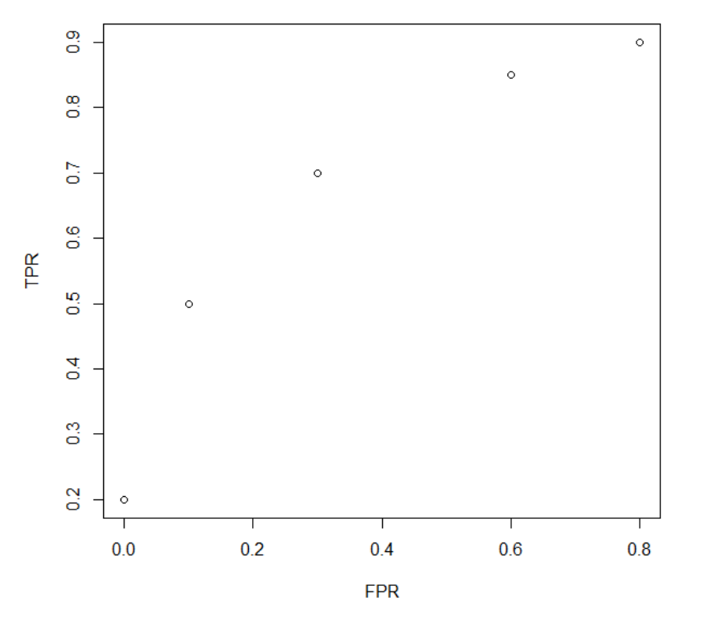
		
		It is clear from this picture that the dot closest to the upper left corner (the ideal unfeasible case with $\text{FPR}=0$ and $\text{TPR}=1$) is $(\text{FPR}=0.3,\text{TPR}=0.7)$, which corresponds to $c=0.5$.
	
	---
	
	In a parallel universe, to predict the class of any unlabeled unit the analyst makes use of the k-nearest neighbour rule. To select the value of $k$ the analyst considers a number of alternative values $k$=1, 2, 3, ... and evaluates the true positive rate (TPR) and the false positive rate (FPR) corresponding to each value of $k$. The picture here below represents (1-TPR) and FPR as a function of $k$. Which value should the analyst choose for $k$? Explain.
	
	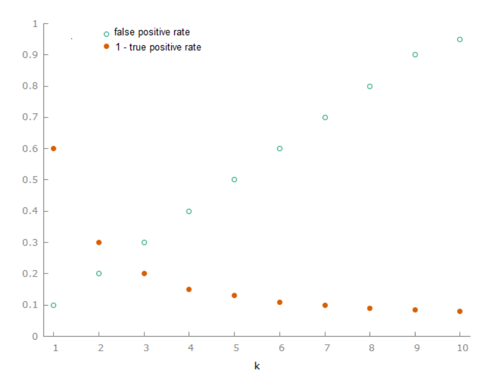
	
	??? answer
		The target is to keep both FPR and (1-TPR) as small as possible. The picture illustrates that there is a conflict between the two targets: by increasing $k$, (1-TPR) decreases but FPR increases. A reasonable compromise is either $k$=2 or $k$=3, corresponding to the values of $k$ fo which (1-TPR) is similar to FPR.
	
	---
	
	Now, let the cost of missclassifying a $Y$=1 unit be 100, while the cost of missclassifying a $Y$=0 unit be 100. The $Y$=1 units and the $Y$=0 units are 50% each in the sample. Taking into account these costs, which value of $k$ would you suggest? Explain.
	
	??? answer
		 If instead of minimizing (1-TPR) and FPR one is willing to minimize the cost of missclassification errors, then he must take into account the cost of missclassification for the two categories as well as the number of units belonging to the two categories.  
		 The total cost function of missclassification is:
		
		$$
		\begin{split}
		\text{Total cost} &= \text{Number of "Y=1" units} \times \text{Probability of "Y=1" misclassification} \times \text{Cost of "Y=1" misclassification} \\
		&+ \text{Number of "Y=0" units} \times \text{Probability of "Y=0" misclassification} \times \text{Cost of "Y=0" misclassification}
		\end{split}
		$$
		
		However, in this case the number of units is the same in the two categories, and the cost of missclassification is the same for the two categories.  
		In the end, what matters is again only FPR and (1-TPR) as in the previous answer, and this leads to the same ideal number of $k$.

!!! exercise
	The picture here below represents feature $Y$ vs. feature $X$ for 200 units. The analyst is searching for meaningful clusters of units within this dataset.
	
	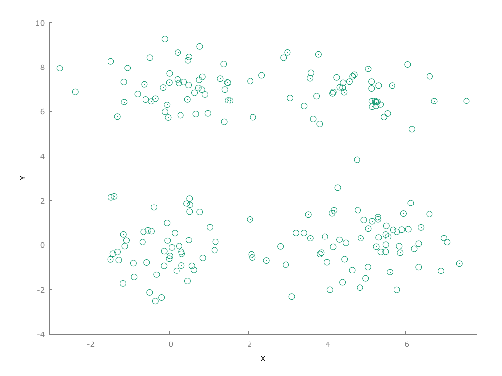
	
	The analyst tries with k-means clustering, setting the number of clusters $k$ at alternative values: $k$=2, 3, 4, 5, ...  
	The resulting Sum of Squared Errors (SSE) as a function of $k$ is summarized in the following graph.
	
	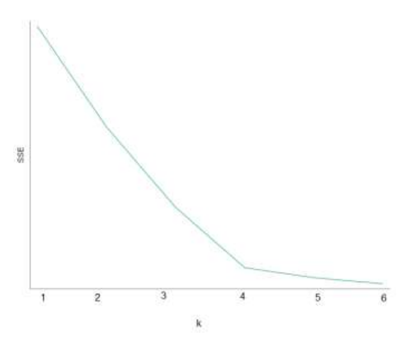
	
	Which value of $k$ would you suggest? Explain.
	
	??? answer
		The Sum of Squared Errors (SSE) is the measure usually adopted for the degree of similarity (with respect to the feature taken into consideration: here $X$ and $Y$) between units belonging to the same cluster:  
		the smaller SSE the more similar units belonging to the same cluster. Since our target is to group together in a specific cluster only similar units, we prefer a small value of SSE.
		
		On the other hand, we do not want to split too much. Otherwise, we are at risk to break a true cluster. To balance these two conflicting targets, the rule of thumb is to start with a low value of $k$ (such as 2), and then increase it step by step and stop when increasing $k$ by 1 the resulting reduction in SSE is small.  
		
		In the picture here above, the reduction in SSE is large increasing $k$ from 2 to the 3, as well as from 3 to 4.  
		Instead, it is much smaller increasing $k$ from 4 to 5.  
		That is, $k$=4 is a plausible solution.
	
	---
	
	 After selecting the optimal value of $k$ (named $k^*$), the analyst discovers that selecting different starting values for the $k^*$ centroids, the solution of k-means clustering changes.  
	 The table here below summarizes the results produced by the k-means software.
	 
	| Solution   |  SSE |
	| ---------- | ----:|
	| Solution 1 | 4.10 |
	| Solution 2 | 3.90 |
	| Solution 3 | 4.00 |
	| Solution 4 | 3.95 |
	
	Explain to the analyst how to interpret this table to select a solution.
	
	??? answer
		After setting $k^*$=4 from the previous question and having tried the k-means algorithm several times starting form different values for the centroids of the clusters, the ideal solution is the one with the smallest SSE, in this case Solution 2.

!!! exercise
	In a classification problem the analyst has a sample of units on which he observes a score $X$ and whether units belong to category A or B. The distribution of $X$ in the two categories is in the figure here below (green=A, red=B). It is known that in the population 50% of units belong to category A, the remaining 50% to category B.
	
	To classify unlabeled units the analyst sets a threshold for the values of $X$: if next unlabeled unit features a value of $X$ below the threshold $t$ it is classified as A, otherwise as B. The figure here below shows the true positive rate (TPR) and the false positive rate (FPR) for category B corresponding to a specific choice of the threshold.
	
	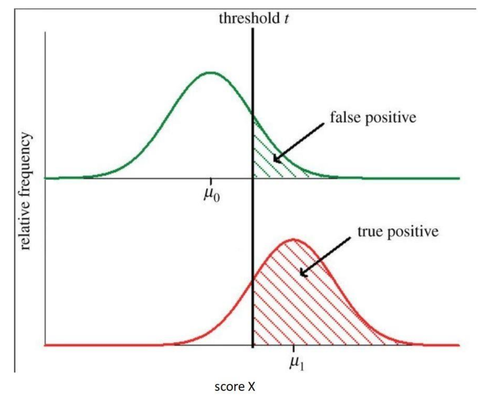
	
	The analyst argues that moving to the right the threshold $t$ in the figure is a good idea because this way the TPR for category A would increase. Comment this proposal.  
	Assume that the cost of a missclassification error is the same for the two categories.  
	
	??? answer
		 It is true that the TPR for category A would increase. But this is counterbalanced by a decrease in the TPR for category B. To decide, one should carefully check whether the change is worthwhile, e.g. by looking at the ROC curve.
	
	---
	
	 Now suppose that in the population the proportion of units belonging to category A is 0.1, being 0.9 for category B.  
	 Would you move the thereshold $t$ to the left or to the right? Or would you keep it as it is? Explain.
	
	??? answer
		The total cost of missclassification as a function of the cutoff $t$ is:
		
		$$
		\begin{split}
		\text{Total cost} &= N \times 0.9 \times (1-\text{TPR}_{(t)}) \times c + N \times 0.1 \times (\text{FPR}_{(t)}) \times c \\
		&= N \times c \times (0.9 - 0.9\text{TPR}_{(t)} + 0.1\text{FPR}_{(t)})\\
		\end{split}
		$$
		
		Where $N$ is the number of units in the population (90% of them in B, 10% in A), $c$ is the cost of missclassifying one unit (the same in the two category), $\text{TPR}_{(t)}$ and $\text{FPR}_{(t)}$ as in the text but emphasising their dependence on the cutoff $t$.
		
		Moving $t$ to the left, both $\text{TPR}_{(t)}$ and $\text{FPR}_{(t)}$ increase. But the net effect is negative, resulting in a reduction of the total cost, because the negative coefficient on $\text{TPR}_{(t)}$ (0.9) is much larger in absolute value than the positive coefficient of $\text{FPR}_{(t)}$ (0.1).
	
	---
	
	 Now suppose that the average value of $X$ for category B is shifted to the right to $μ_1$+10.  
	 Would you move the threshold $t$ to the right or to the left? Or would you keep it as it is? Explain.
	
	??? answer
		Shifting the average $X$ for category B to the right means that the current cutoff $t$ ends up on the left tail of the distribution of $X$ for that category. That is, the current cutoff would imply a much larger value of TPR while FPR would be the same.
		
		Given the shape of the two distribution we observe in the picture, it makes sense to move the cutoff to the right because this waythe reduction in the TPR would be more than counteracted by a reduction of FPR.
	
	---
	
	Suppose the cost of missclassifying a B unit is much larger than the cost of missclassifying a A unit (10 times larger, say). With respect to the figure, would you move the threshold to the right? To the left? Or keep it as it is? Explain.
	
	??? answer
		Given the evidence in the picture, it is clear that marginally moving the threshold to the left the increase in the TPR for B is approximately the same as the increase in the FPR for A. Since the cost of missclassification is much larger for B, the gain from increasing the TPR for B would be much larger than the cost of increasing the FPR for A.
		
		It would be then best to move the treshold to the left.

!!! exercise
	The scatterplot here below represents a sample of units according to the values of two variables, $X$ and $Y$. An analyst performs a k-mean cluster analysis trying with different values for the number of clusters (k).  
	He chooses to evaluate the centroid of each cluster using the median of the two variables $X$ and $Y$.
	
	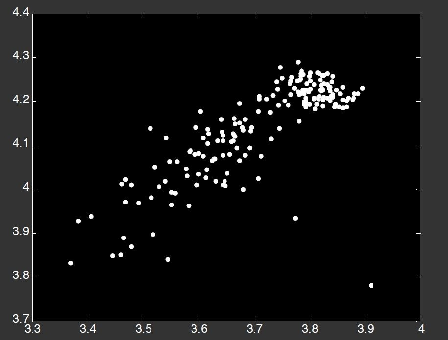
	
	The figure here below reports the value of SSE as a function of k (the screeplot).
	
	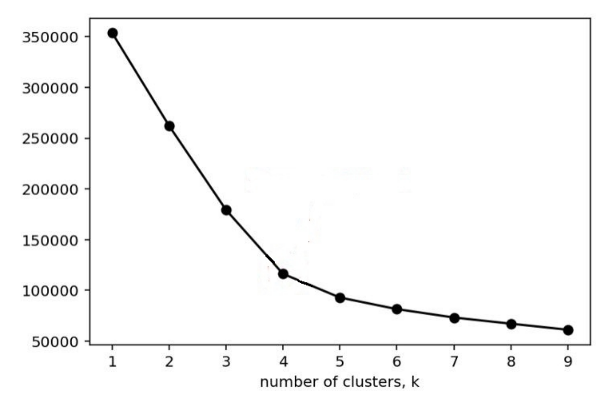
	
	Which value would you choose for k? Explain.
	
	??? answer
		I would go with $k$=4 because the gain from moving to $k$=5 is much lower than the gain from moving from $k$=3 to $k$=4. In short, in this specific case there is an _elbow_ at $k$=4.
	
	---
	
	A second analyst criticizes these results arguing that the unit to the bottom right of the scatterplot is an outlier.  
	 According to this analyst, that unit should be discarded from the sample because it bears an excessive influence on results. Do you agree this unit should be dropped? Explain.
	
	??? answer
		The second analyst should resign his job immediatly. The first analyst evaluated the centroids using the median of $X$ and $Y$, not their mean. Differently from the mean, the median is unaffected by abnormal values.  
		As a result, dropping that unit from the sample would not change the medians, hence the resulting clusters would be exactly the same.
	
	---
	
	Now the analyst receives another piece of information on the same sample of units: labels to classify each of them into one of three possible classes (blue, red and green in the picture).
	
	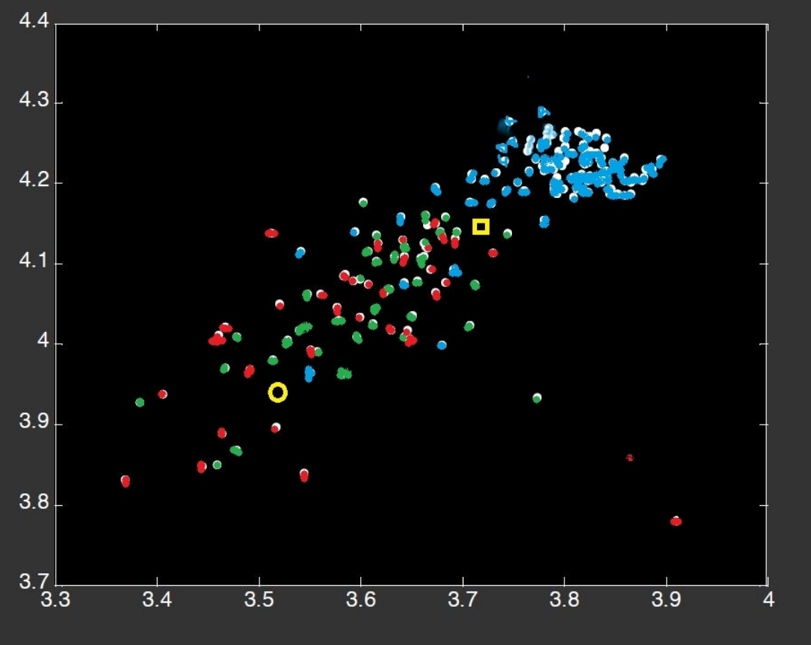
	
	Keeping all the three clusters the SSE is as large as 2.5 while collapsing the green and the red cluster into a single cluster the SSE drops to 2.4. Would you go with three clusters or two clusters? Explain.
	
	??? answer
		Decreasing the number of cluster the SSE cannot decrease!  
		
		That said, it is clear that in this case the green and the red clusters can be safely merged together.
	
	---
	
	A new unlabeled unit comes in, it is the yellow square on the scatterplot. Think of classifying it using the $k$ nearest neighbour. Does the result depend on the value of $k$? What about the unit corresponding to the yellow circle?
	
	??? answer
		The yellow square looks problematic. With a small value of $k$ it is likely to be included in the red or green cluster. With a larger value of $k$ even the blue cluster becomes a reasonable choice.  
		Let’s say that a fair account is that the yellow square could be classified one way or the other.  
		
		The yellow circle instead ends up in the red/green cluster, without doubt.
	
	---
	
	The analyst decides to use the k-nearest neighbour to classify new unlabeled units. To choose the value of $k$ he splits the sample in two subgroups: a training set and a test set. Then, he classifies units in the test set using alternative values of $k$ ranging from 3 to 8.  
	The picture here below show at each value of $k$ the proportion of blue units correctly classified in the blue cluster TPR and the proportion of non blue units erroneously classified in the blue cluster (FPR).  
	
	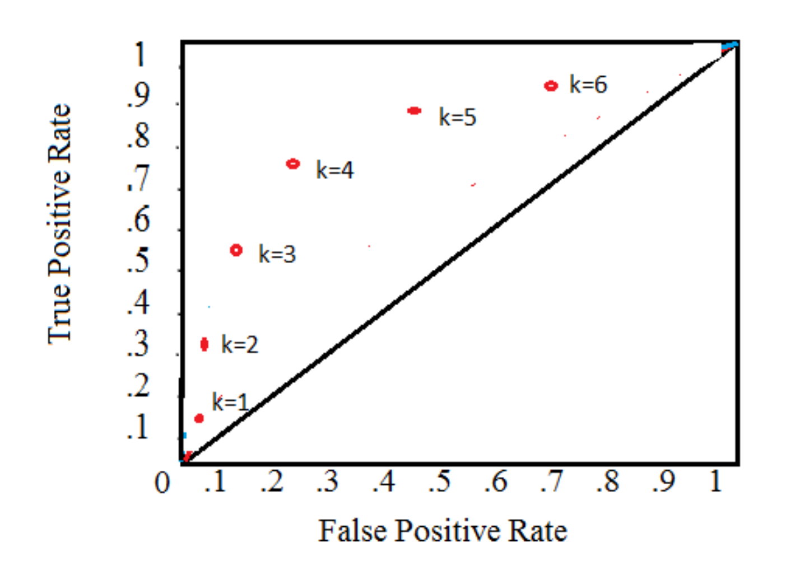
	
	Which value of $k$ would you choose? Explain.
	
	??? answer
		 $k$ here is the number of nearest neighbors taken into consideration by the classification rule, and not the number of clusters.
		The optimal, unfeasible solution would be a value of $k$ taking us to the upper-left corner, i.e. TPR=1 and FPR=0. This is unfeasible in any practical instance, but the closer we get to it, the better.  
		In this case the feasible solution closest to the optimal one is $k$=4, as it is clear from the picture that the red dot corresponding to $k$=4 is the one closest to the upper-left corner.
	
	---
	
	Let the cost of missclassifying a blue unit be 100, while the cost of missclassifying a non blue unit be 50. The training set (a representative sample of the population) includes the same number of blue and non blue units. Taking into account these costs, with reference to the previous picture which $k$ would you choose?
	
	??? answer
		Let N be the total number of units: N/2 are blue, N/2 are not blue (say red), according to the text.  
		The total missclassification cost is given by the number of units times their misclassification probability times the misclassification cost, for all the types of units:
		
		$$
		\begin{split}
		\text{Total cost} &= N_B \times P(M_{B}) \times C_{B} + N_R \times P(M_{R}) \times C_{R} \\
		&= \frac{N}{2} \times (1-TPR) \times 100 + \frac{N}{2} \times (FPR) \times 50 \\
		&= 50N \times (1-TPR) + 25N \times (FPR) \\
		&= 25N \times (2\times(1-TPR) + FPR)
		\end{split}
		$$
		
		The results are reported here:
		
		| $k$ | 1-TPR value | FPR value | Total cost |
		| ---:| -----------:| ---------:| ----------:|
		|   1 |        0.85 |      0.05 | 25N x 1.75 |
		|   2 |        0.70 |      0.07 | 25N x 1.47 |
		|   3 |        0.45 |      0.15 | 25N x 1.05 |
		|   4 |        0.25 |      0.25 | 25N x 0.75 |
		|   5 |        0.10 |      0.45 | 25N x **0.65** |
		|   6 |        0.05 |      0.70 | 25N x 0.80 |
		
		The total cost is minimized at $k$=5.
	
	---
	
	A second analyst proposes an alternative classification rule. Its Receiver Operating Curve is represented in the picture here below as the blue line.
	
	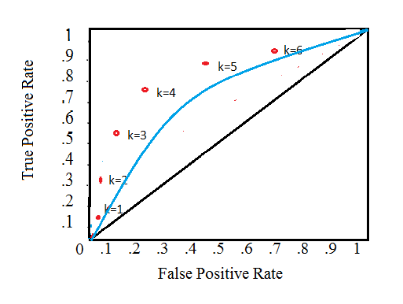
	
	To solve the classification problem which rule would you choose? The new one? Or the $k$ nearest neighbour as of in the previous questions? Explain.
	
	??? answer
		The blue classification rule is clearly worse than the red one. At any possible value of the FPR, the red TPR is larger than the blue one.  
		To put it in other words, the black diagonal line in the picture is the ROC associated to the worst classification rule, i.e. classifying units by tossing a coin. The closer a ROC to the black diagonal, the worse the classification rule. In this case, it is clear that the blue ROC is closer to the black diagonal than the red ROC.

!!! exercise
	The marketing manager of a company runs a survey to understand the characteristics of the market for a new product. It is a simple questionnaire collecting the characteristics of respondents in a sample drawn out of the population as well as their willingness to buy the new product (it is described in the questionnaire). Then, the data are analyzed to produce the tree in the figure here below. Each leaf of the tree reports the number of respondents therein. For each leaf the fraction of individuals willing to buy the new product is also reported. For instance, leaf 4 reports a fraction as large as 0.525 among the 200 respondents.
	
	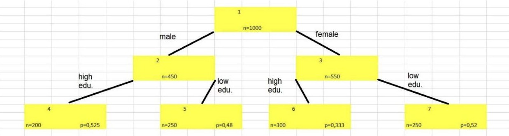
	
	Using the data in the figure derive the proportion of individuals willing to buy the product among males (node 2) and among females (node 3) as well as the standard errors of those proportions.
	
	??? answer
		The proportion in node 2 is: 
		
		
		$$
		\begin{split}
		P_{M} &= \frac{200 \times 0.525 + 250 \times 0.48}{200+250} \\
		&= 0.50 \\
		\text{S.E.}_{M} &= \sqrt{\frac{0.50 \times (1-0.50)}{200 + 250}}\\
		&= 0.02357 \\
		P_{F} &= \frac{300 \times 0.333 + 250 \times 0.52}{300+250} \\
		&= 0.418 \\
		\text{S.E.}_{F} &= \sqrt{\frac{0.418 \times (1-0.418)}{300 + 250}}\\
		&= 0.02103 \\
		\end{split}
		$$
	
	---
	
	Establish whether the difference between the two proportions derived at the previous point is statistically significant.
	
	??? answer
		To establish the statistical significance it is needed to derive the confidence interval for the two proportions at a certain level, in this case 0.95:
		
		$$
		\begin{split}
		P_{M}: &(0.50 \pm 1.96 \times 0.02357) \\
		&(0.4538, 0.5462) \\
		P_{F}: &(0.418 \pm 1.96 \times 0.02103) \\
		&(0.3768, 0.4592) \\
		\end{split}
		$$
		
		In this case the two intervals are just marginally overlapping (the higher limit of $P_{F}$ is contained in $P_{M}$ interval), and this is at the border of statistical significance

--8<-- "docs/courses/sfm/glossary.md"